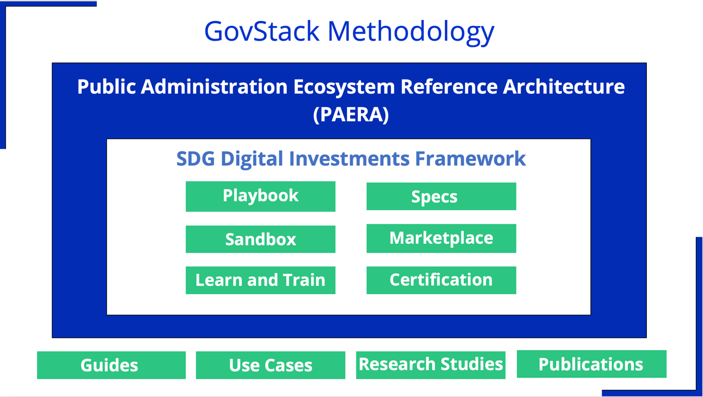

# 2. State of Digital Transformation

## 2.1 Problem statement

#### Internal factors

The history of digital transformation initiatives is marked by numerous large and ambitious projects that have failed despite being constructed and funded by well-intentioned donors, whether domestic or foreign. Projects often introduce foreign ideas to a given society, which the society needs to assimilate in meaningful ways. If successful, they would bring about the desired benefits. However, often, they fail because the local cultural environment clashes with the underlying ideas upon which the benefits have been built.

To avoid failure and unnecessary spending, a country must carefully select a suitable action plan based on the needs and capabilities of the target groups who will benefit from the developed products. It is natural to want to adopt the best practices from around the world and use new technologies to speed up progress towards a better future, but this can only be done under certain circumstances.

#### External factors

Software markets are typically effective in meeting the needs of the private sector. Thanks to globalization and trade liberalization, successful software products are quickly accessible to users worldwide. As the customer base grows, the quality of products also improves. However, public administration practices and working processes differ significantly from those of the private sector, making it challenging to cater to the needs of the public sector.

While user functional and non-functional requirements can be agreed upon easily across cultures, harmonizing legislation and administrative procedures is challenging. It is therefore fair to say that automating a specific function in the public sector of a given country is a one-time occurrence.&#x20;

A global ERP vendor may have hundreds of thousands of customers in the private sector. However, a vendor selling, for example, tax administration software can only target around 200 tax administrations worldwide, making it a less attractive market for vendors. For this reason, mature and fit-for-purpose public administration-specific solutions are not in high demand. Many vendors claim to have public administration solutions. Upon closer inspection, these solutions may not be effectively tailored to a specific public administration context.

#### Technology factors

People believe that once a new technology solution is implemented, the problem is solved. Tough reality of Digital Age is that at this moment life-cycle of the new asset just starts.&#x20;

To maintain a solution's functionality, it is necessary to regularly upgrade its security features, adjust its software to keep up with changing infrastructure, address user issues, and define and implement new requirements. However, these needs are often overlooked by management, resulting in irregular implementation of security patches and using shortcuts during changes.&#x20;

This leads to the emergence of new legacy systems that are difficult to manage. A new cycle of the COBOL-ization process begins, investments are not sustainable, and systems are too complex. Finally, development stops, and all effort goes into maintenance.

#### GovStack response

GovStack has a solution to the above challenges:

1. We analyse the best practices around the globe.
2. Findings are consolidated, and appropriate reusable Building Blocks specifications are designed.
3. We point out the important assumptions and dependencies along the planning and implementation processes.
4. Specifications of Building Blocks are disseminated to the software developers’ community.
5. We are actively engaging with solution providers, seeking products that can be candidates for implementation of Building Blocks specifications.
6. We closely monitor Building Blocks implementation practices and learn from them, further improving the GovStack proposition.

#### Outcome Architecture

GovStack is a digital transformation approach aimed at creating prosperity for people by converting technological advances of the last decades into new capabilities for everybody

<figure><figcaption>
Figure 1 - Outcomes architecture of digital transforamtion
</figcaption></figure>

The digital transformation of the public sector is expected to benefit society as a whole, the economy, and the government sector.

* Society: fostering communities’ relationships, new capabilities for individuals to participate and thrive in all dimensions of their life, enhancements of the overall well-being and happiness of the population, including considerations such as healthcare, education, and cultural enrichment.
* Economy: less bureaucratic barriers, financial inclusion, new local jobs, new knowledge-based industries, better regional and international trade conditions.
* Government sector: cost-efficiency, pro-active service delivery, better workplace culture.

Consider this model when setting objectives for digital transformation initiatives to ensure better sustainability of efforts.

## 2.2 GovStack Methodology

GovStack is an initiative that aims to gather best Digital Government practices from case studies worldwide. It also seeks to create a reference architecture of building blocks for a Digital Government reference model.&#x20;

GovStack provides a platform for vendors and developers to have open access to building blocks on the supply side and Digital Government personnel on the demand side. GovStack bridges the gap between governments seeking to transform their practices and the developers and vendors who offer the necessary building blocks for successful solutions.

The GovStack Methodology follows a building block approach that aligns with the SDG Digital Investment Framework's whole-of-government philosophy ([Source](https://www.itu.int/pub/D-STR-DIGITAL.02-2019))

<figure><figcaption>
Figure 2 - GovStack methedology componenets
</figcaption></figure>

To facilitate the activation of the methodology, GovStack has created this Public Administration Ecosystem Reference Architecture (PAERA) outlining the necessary framework for the public sector to approach digital transformation in a practical, effective, efficient, and sustainable way.

GS develops [GS Specs](https://app.gitbook.com/o/pxmRWOPoaU8fUAbbcrus/s/zdXe8NbIMZIv5sydPBf6/) to define building block requirements, dependencies, and usage guidelines for implementing solutions using those building blocks.\
GS develops GS Playbook to provide recommendations to government CIOs for implementing best Digital Government practices for solution design and related activities.\
\
GS architects identify available open source or commercial components that align with specs API and place them to GS Sandbox for demonstrations and rapid prototyping sessions during discussions with countries’ solutions architects.

Components that pass tests against defined specs can be placed on GS Marketplace for countries to consider during their transformational journeys.

GS working groups develop training materials, which are available in GS Learn & Train for staff training during change management.

The GS Certification program streamlines the process of hiring competent solutions architects to design transformational initiatives in different countries. This program evaluates a candidate's previous experience, work in GS working groups, and performance in the certification exams. It helps to certify professionals who can effectively implement the GS approach in their respective countries.

The methodology focuses on modern digital government systems' end-to-end life cycle management, enabling sustainable investment and reliable public administration. It leverages proven practices from digitally advanced societies to prioritize interoperability, reuse, and sustainability, simplifying and accelerating public sector digital transformation using proven technology blocks and governance and change management practices.

GovStack Knowledge Base compiles knowledge from country use cases and research studies, and shares guides and publications on best practices for digital transformation.

## 2.3 Role of Enterprise Architecture

#### Key Concepts

In PAERA, we require a practical and straightforward definition of Enterprise Architecture (EA). Some Chscholars criticize popular EA approaches, claiming that they are purely philosophical and unrealistic and provide little practical advice. They argue that the term EA has been utilized as an umbrella term to refer to a single comprehensive description of an organization developed and used by stakeholders (Ibid).

Enterprise architecture can be defined as a collection of documents describing various aspects of an organization from an integrated business and IT perspective, intended to bridge the communication gap between business and IT stakeholders, facilitate information systems planning and thereby improve business and IT alignment (Source: Kotusev, Svyatoslav. The Practice of Enterprise Architecture: A Modern Approach to Business and IT Alignment (p. 19). SK Publishing. Second Edition 2021).

The blend of Enterprise Architecture practice with the building blocks approach offers multiple advantages, such as cost savings, speed, real economic return, and agility, combined with responsiveness, integration, and information exchange to achieve interoperability, adherence to common standards, and minimizing vendor lock-in.

The discipline of Enterprise Architecture provides visibility into an organization, its activities, and its systems. It considers four different points of view that are central to understanding an organization:&#x20;

* Business Architecture. In EA practice, we refer to business architecture when we think about customers and the services that an organization provides to them. However, there are more important and interesting aspects to business architecture than just customers and services, such as business processes, regulations, key performance indicators, etc.
* Application Architecture. When people use application software to accomplish some tasks, we can say that the business process of this task is supported by an application. When we describe an organisation's all applications, which are used by a variety of business processes, then we would define the organisation's application architecture.
* Data Architecture. Recently, an increasing number of people have realized that automating business processes and service delivery is important, as is analysing the data collected by their organization. By doing so, they can adjust their business strategy and activities to enhance their achievements. For doing data analysis, however, you should know your data. So, when you meaningfully document your data, in EA practice, we say you documented your data architecture.
* Technology Architecture describes all computing, networking, storage, etc. devices that enable an organisation to use digital services.&#x20;

The enterprise architecture practice also provides advice on how to track dependencies between different elements of your architectural layers, both horizontally (within the same layer) and vertically (across layers). Once you create such a layered description of your organization, you will be able to understand how your organization functions as a system.

There are building blocks for every EA layer:

* Within the Business Architecture, a building block is a set of specific recommendations for legal and organizational arrangements.
* Within the Application Architecture a building block is a separately deployable executable software component, described in a specification of the block’s interface (API), and objectives to be achieved using the capabilities of that component.
* Within the Data Architecture, a building block is a definition of the required registries and information repositories and a description of the business capabilities that those registries and repositories enable.
* With the Technology Architecture, a building block is defined as an implementational pattern recommended for delivering secure and scalable ICT infrastructure services.

Reference Architecture refers to the consolidation of previous experience in the domain of digitalisation in public administration. It involves creating templates that structure components of applications and technology to support specific business models presented in the public sector. These templates are used to speed up the development of solutions for Public Administration Organizations (PAOs) and to decrease the risk of design decisions.

For example, in \[Source: Kotusev, Svyatoslav. The Practice of Enterprise Architecture: A Modern Approach to Business and IT Alignment (p. 19). SK Publishing. Second Edition 2021] author provides the following practical visualisation of Reference Architecture in the context of the development of solutions:

<figure><figcaption>
Figure 3 - Reference Architectures and Solution Enterprise Architectures  Source: Adapted from “IT Connect. Information technology tools and resources at the UW” (Univ. of Washington, 2020)
</figcaption></figure>

Such re-use of existing solution experience will be enabled by continues update and development of PAERA in GovStack.

Utilizing EA practice, GovStack lays out a target reference architecture for national level, public administration level, and MDAs.

Finally, GovStack provides an implementation framework for the effective use of PAERA as defined in this document.

Metamodel of the reference architecture provided in the Annex 2.

#### Value proposition

Enterprise Architecture has traditionally been used as a tool to align business and technology domains. This is especially important during times of significant environmental changes, which often require new strategies.&#x20;

Today, technology has the potential to revolutionize the internal operations of public administration organizations. This presents an extraordinary new opportunity that we want to leverage.

The current reference architecture document aims to unlock technology's potential to transform the process of creating public value using architectural and solution building blocks. This transformation can occur rapidly, generating local employment opportunities and revolutionizing entire societies.

In defining the PAERA approach, we want to highlight a few important aspects of the EA value proposition.

First aspect. When a customer with specific business requirements collaborates with a capable developer, they can often come up with a solution that works. In such cases, they may not require the assistance of an architect or architectural document. However, it may not be immediately apparent how well the solution will address requirements that are invisible to the business customer, such as maintainability, scalability, security, and so on. This is when architectural requirements and reference architecture become helpful.

Second aspect. Once a software system is created, it requires regular maintenance, as well as version upgrades annually and technology upgrades at least every decade for as long as the organization exists. If the software is not receiving updates regularly, let’s say at least once per year, and its technology is not entirely renovated at least every 7-8 years, then such software becomes a dangerous legacy, which poses a significant operational risk for the organization. Utilizing Building Blocks supported by independent open-source vendors who actively develop their products will enable the public sector to avoid falling into such legacy traps.

Third aspect. Digitalization of the public sector should not be narrowly seen as the automation of existing business processes. Instead, it should involve the creation of new operating models, with public administration customers at the center.

#### Specific Objectives of the Document

The Reference Architecture:

1. Tries to define specific national infrastructure components, which are foundational for more effective digitalization.
2. Defines a taxonomy of government entities aiming to define set of specific building blocks required for different types of organisations.
3. Provides a practical framework of decisions to be made and implementation activities to be planned by a public administration organisation for effective digital transformation.&#x20;
4. Defines the context and boundaries of the public administration digital ecosystem.
5. Identifies key drivers of digital transformation in a typical public sector organisation.

## 2.4 What is Public Administration?

It is important to define the scope of the reference architecture. Here, we will provide a simplified view of the public sector and its organisational structure.

According to (A unitary state is a state governed as a single entity. There are no federal autonomous regions.), “Government units are unique kinds of legal entities established by political processes that have legislative, judicial, or executive authority over other institutional units within a given area. The principal economic functions of government units are to:

* Assume responsibility for the provision of goods and services to the community or individual households primarily on a nonmarket basis.
* Redistribute income and wealth by means of transfers.
* Engage primarily in nonmarket production.
* Finance their activities primarily out of taxation or other compulsory transfers.

A government unit may also finance a portion of its activities in a specific period by borrowing or by acquiring funds from sources other than compulsory transfers—for example, interest revenue, incidental sales of goods and services, or the rent of subsoil assets. All government units are part of the general government sector.”

From our perspective, the most crucial aspect of this definition is the funding from the public budget and the non-market nature of primary activities.\
Following is an example of how a unitary state defines its public sector (based on Digital Transformation and Public Services, Edited by Anthony Larsson and Robin Teigland, 2020 by Routledge).

<figure><figcaption>
Figure 4 - Public sector units in a unitary system
</figcaption></figure>

In a federal system, the Central Government represents the Federal Government, and an additional budgeting level will be added for federated states/counties. Local municipalities fall under specific states/counties, such as in the USA, Nigeria, India, etc. In this case, the diagram could be presented in the following way:

\

<figure><figcaption>
Figure 5 - Federal country public administration
</figcaption></figure>

In some countries, there are no state-provided social insurance schemes, which means there are no social insurance funds. However, in terms of digitalization, these differences are not important. At the end of the day, these are budget levels with pre-defined sets of responsibilities and revenue sources.&#x20;

In smaller countries, there will be fewer independent budgetary levels and units. In larger countries, there may be more budget levels, some shared revenue allocations from one budgetary level to another, and more budget units. Otherwise, there are not many differences between bigger and smaller countries when it comes to the required building blocks for digital transformation.

**Government sector** – includes public sector entities that are not considered market producers and are financed mainly by compulsory payments made by entities belonging to other sectors. In a typical small or medium-sized country, the government sector is divided into three sub-sectors: central government, local governments and social insurance funds.

**Other public sector** – public sector companies that produce goods and services with the participation of the state and other government sector members (e.g. utility companies, strategic resource processing, etc.) and Central Bank.

**Central government** – state institutions belonging to the sub-sector of the central government (government institution, state institution managed by a government institution, county court, administrative court and district court); constitutional institutions (the Chancellery of the Parliament, the Chancellery of the President of the Republic, the National Audit Office, the Chancellery of the Chancellor of Justice and the Supreme Court) and the institutions in their administrative area; legal entities of the central government (a public legal entity defined as a central government unit, a foundation established by the state and a company with state participation).

**Local government** – the right, ability and obligation of the democratically formed authorities of a self-governing unit - municipality or city - to independently organize and manage local life on the basis of laws and the legitimate needs and interests of the residents of the municipality or city and taking into account the peculiarities of the development of the municipality or city.

A public service institution, or public authority, is an institution financed from the budget of the state or local government unit, whose task is to exercise public authority.

**Managed institution** – state institutions financed from the state budget, whose main task is not to exercise executive state power, but on the basis of the law, state institutions managed by government institutions can exercise executive state power. State institutions managed by government agencies belong under a ministry's jurisdiction.

The current reference architecture is applicable mainly to non-market activity units.

## 2.5 What is Digital Government?

A couple of important concepts still need to be defined for the clarity of our further discussion.

The term “digitization” entails the conversion of non-digital material (such as images, video, and/or text, etc.) into a digital format (Digital Transformation and Public Services, Edited by Anthony Larsson and Robin Teigland, 2020 by Routledge).

The term "digitalization" refers to the process of adopting or increasing the use of digital/computer technology, including mobile applications. This technology is usually implemented to establish a communication infrastructure that connects various activities and processes of the actor (Ibid).

The term "digital transformation" encompasses strategic business changes driven by customer needs, requiring extensive organizational change and the adoption of digital technologies. It involves multiple projects and requires organizations to effectively manage change. Essentially, digital transformation makes organizational change a core competency as the goal is to become customer-driven from end to end (Ibid).

#### **Digital Governance Model**

Several prerequisites need to be addressed before transformative projects can be targeted to achieve ambitious digital transformation objectives. These prerequisites rely on data flows and have strict dependencies on various building blocks. Digital transformation teams in any country should be aware of these preconditions, as they need to be addressed before one can successfully implement specific building blocks.

We will express the idea of those preconditions through the following metaphor. We say that Digital Governance can be seen as a building as follows:

<figure><figcaption>
Figure 6 - Digital Governance Infrastructure Framework (Source: Ivar Tallo &#x26; Aare Lapõnin)
</figcaption></figure>

While houses in different cultures can be quite different, the basic principles of their construction are similar. First, one needs to build the foundation. There are foundational cross-cutting issues of governance and policy — as well as legislative framework — that support the walls and pillars, which support the roof. Similarly, the framework is based on a causal sequence; one input causes other Digital Governance aspects to succeed. Such 'inputs' are called underlying conditions for Digital Governance.

From bottom to top level, we describe layers in the following way.

Digital Governance Infrastructure includes Foundation and National Level infrastructure.

#### **Foundation**

Foundation Frameworks, which consist of horizontal preconditions, meaning that they are applicable in any case.

1. **Legal frameworks** or applicable laws are necessary preconditions for different types of building blocks, and they are discussed later in Chapter 3. Technical solutions in the form of building blocks can usually only be implemented after there is a legal basis for them, and this usually goes outside the specific building blocks themselves.&#x20;
2. **Governance & Policy frameworks** are also necessary to coordinate digitization efforts. While it is possible to develop one or another application autonomously, this approach is not cost-effective from the general development point of view.

#### **National Level**

The Digital Infrastructure Pillars are essential technical conditions for achieving goals. Completing them before developing functional applications in ministries and departments is often impossible, but at least they should be somehow addressed before pursuing wide and ambitious modernization goals.

1. **Access** in terms of connectivity of offices and citizenry seems to be a self-evident precondition, but we have brought it out here. After all, there are still a lot of situations where otherwise good projects die mysteriously after being successfully executed because either the people do not have the possibility or the habit of using the internet, or offices don’t have internet access or have it in a very limited way, making it very hard to be part of the digital data flows.
2. **Digital Data**, or rather the need to digitize data has been rising in importance as we started to talk about digital government, but it is a topic of a rather large scope that needs to be addressed by a multitude of specific efforts, found in different building blocks of the GovStack. &#x20;
3. **Interoperability** is the ability of the government to exchange data inside and with the outside world and it requires a significant effort by any government to introduce. Different approaches to interoperability and its components are expressed in technical terms in the Enterprise Architecture framework, and introducing this requires any government a major effort and dedication, and support on the highest government levels. &#x20;
4. The **Digital Identity** pillar describes efforts to create common semantics for the information government is collecting and allowing us to construct transactions in the virtual world by citizens and businesses as well as giving a legal protection to these transactions where necessary.&#x20;

The governance and legal framework questions spanning different areas don't need to be explained separately. However, it is very important to provide examples of best practices and explain why they work.

#### **Pillars as Digital Infrastructure**

Pillars are crucial in constructing a strong foundation for a "digital house" and thus will be elaborated a bit more.

The first pillar, Access, is a fundamental requirement in today’s world and can take various forms, such as connectivity for offices and citizens. However, it may require specific attention based on the entities and regions, as something that may seem obvious in the country’s capital may not be the case just outside its boundaries. Without sufficient Access, other digitalization efforts are meaningless, as demonstrated by attempts to teach digital skills using traditional blackboards.

The second pillar or underlying condition is digital data. It is obvious but also a time-consuming and resource-hungry endeavour that cannot be resolved with just one straightforward project or GovStack building block. It requires both the overall framework development and the consideration of government-specific functions such as accounting for land, people, property, and activities.

The third pillar is interoperability. Once we have digital data, we need to be able to reuse it in different information systems to avoid repeating the same operations in various government departments. This requires planning for and introducing interoperability. Without interoperability, IT investments will be limited to simply automating existing processes, which will not bring any additional value to society. Value can only be created by redesigning old processes.

Finally, we need to be able to navigate the digital realm and prove our identity in the court of law, so we need a mature system for digital identity.

#### **Level of a Public Sector Organisation**

At the organizational level, successful digital transformation requires the presence of the following dynamic capabilities:

* **Management & Architecture** – The management of the organization understands the significance of digitalization and is capable of implementing the necessary change management to transition operations from paper-based processes to a completely digital operational environment. The IT personnel are capable of overseeing the overall architecture to ensure the sustainability of investments.
* **Digital Service Culture** – Transitioning from paper-based to digital service delivery requires a significant cultural shift within an organization. This shift is essential to ensure smooth adoption of new technologies and maximize the benefits of digital transformation. The organization should internally adapt to deliver services to customers in a fully digital manner, prioritizing customer satisfaction.
* **Data-driven Decisions** – An organization can make data-driven decisions when it can consolidate all available data, manage its quality and availability securely, and there is a management who is motivated to be data-driven on a daily basis.
* **Digital Co-creation** – Digital co-creation is a new concept. Traditionally, the government executed its mandates from behind tall walls of laws and professional public administration apparatus. In the digital era, a successful organization should be capable of sourcing digitalization initiatives within its local community of stakeholders and sharing the available data back to communities.

Also, we have to admit that successful digital transformation at the organizational level is nearly impossible without a mature Digital Governance Infrastructure.

#### **Public Reform & Governance**

There are many higher-level concepts that tend to attract decision-makers’ attention over the preconditions viewed as technical. Many donors and governments themselves view these higher levels of changes under the common umbrella of **Public Administration Reform (PAR)**.

However, as we already mentioned, constructing of a house, one does not start from the roof or windows. While the interest of decision-makers can be in providing various digital services or data-driven decisions (i.e., “doors” and “windows”), the reality is that one first needs to build the foundations and the “walls”.

### **Role of GovStack**

GovStack aims to ensure that partner countries are aware of the model of dependencies described above when approaching digitalisation initiatives.

## 2.6 Change management

#### **Continuous Process**

Change management deals with modernisation projects at organizational level. However, government-level concerns must also be addressed. These are often referred to as reforms arising from political debates. Digital Transformation – one of such reforms – should address the government's vision, policy statements, and legal changes.

The GovStack Approach can only be implemented within a systematic practice of Change Management both at government as well as organisational level:

* As foreseen in policies, national digital infrastructure capabilities are being planned and developed at central, regional, and municipal levels.&#x20;
* Organisational capabilities are planned and developed in MDAs at all levels of a country's public sector.
* There is a practice to support implementation of projects from legal and administrative perspectives.
* Development of government internal IT capabilities to manage sustainable delivery of software solutions for digital services.

#### **Quality Attributes of the Process**

GovStack emphasizes that digital transformation will create a new digital public infrastructure (DPI) for the upcoming digital era. It is crucial to ensure that while developing DPI, both the outcomes and the process are clearly defined, with a focus on reflecting public needs. To achieve this, the process must meet specific requirements, which can be illustrated as follows (Source: \[8]):

<figure><figcaption>
Figure 7 - Requirements for Digital transformation process (Source: [8]).
</figcaption></figure>

**Purpose and Directionality**. In a "common good" framework, two critical capabilities are setting directionality and orchestrating the process. There is a growing trend of desiring more explicit directionality in building shared digital infrastructure. DPI is not neutral and shapes what can be built on top of it. Therefore, it is crucial to make the nature of directionality explicit and prioritise it.&#x20;

One case in which purpose and directionality are made explicit in DPI is India’s identity system, Aadhaar. To the Indian government, the main reason for establishing residents’ identity was to simplify the distribution of welfare benefits (including direct cash transfers, subsidised food, cooking gas and other benefits). The government feared that a substantial portion of those benefits was being wasted due to fraud and corruption. Building a system to identify an individual uniquely was paramount to prevent fraud and improve the targeting of social benefits. Directionality simplified scaling and KYC compliance for banking and telecommunications and prevented welfare benefit leakage.

In contrast to the Indian case, the digital identity system in Jamaica was not built with an explicit, primary purpose in mind. Initially, the Jamaican government declared an interest in building an ID system but did not link it to a primary policy purpose. This allowed others to imagine the ID’s purpose, fostering the distrust of civil society actors, who were suspicious of the government’s intentions. It was also a wasted opportunity, as the government did not focus on developing a programme or application that would benefit its citizens.

**Co-creation and participation**. The common good stresses collaboration, coordination, and co-investment among different entities. Co-creation and participation should be integral to the governance process. Institutional mechanisms should be established for collaboration around DPI. Participation around proprietary technologies is challenging.

A good example of successful co-creation is Brazil's Pix, a new instant payment scheme launched in November 2020 by Brazil's Central Bank. It allows citizens, companies, and government entities to transfer payments quickly and easily, even on non-business days. The team behind Pix understood the importance of involving society in the development process and breaking away from traditional practices of working in silos. This led to the creation of the Pix Forum, a collaborative governance practice that brought together more than 130 representatives from various societal groups, including banks, fintechs, civil society organizations, and small business associations. The team processed feedback from all participants, which was a challenging but necessary step towards the success of the project. The Pix Forum's co-creative process was instrumental in developing a solution that was user-centric and met the needs of society.

**Collective learning and knowledge-sharing**. Learning from each other's successes and failures and encouraging knowledge-sharing and collective intelligence is crucial for collective value creation. Institutionalized learning and knowledge accumulation can create long-term state capacities. Innovative institutional examples can facilitate collective learning.

One example is Bangladesh’s Aspire to Innovate (a2i) programme, whose goal is to ‘drive collaborative digital innovation for the public good. In practice, it serves as a think tank inside the government, focused on technology projects that are geared towards helping the country achieve the SDGs. The programme is an arrangement that allows the government to integrate inputs from, and collaborate with, civil society groups. More importantly, the model provides lessons to the DPG ecosystem in Bangladesh by demonstrating the capacities and talents needed to support the maintenance of digital public goods.&#x20;

Encourage collective learning with DPI by incentivizing open-source software and communities of code led by digital public goods enthusiasts. External contributors are key for effective learning. Here is a good example.

MOSIP is a solution that helps countries to implement open-source identity systems. It offers an open approach to contributors, which means that they can introduce new features or fix bugs, covering a spectrum of tasks, from requirements and design to coding, testing, and documentation. While some components are closely governed with limited room for external input, to avoid adopters bypassing the safety and do-no-harm mechanisms built into the technology, other components are more open to external contributions. This comprehensive approach strengthens the system, establishing clear pathways for contribution while adhering to submission and reporting guidelines.

**Access for all and reward-sharing**. Universal access and reward sharing are crucial to the concept of the 'common good' in policymaking. If an infrastructure benefits everyone, it must be accessible to all, and its benefits must be shared with society. Governments prioritize access and inclusion over market pricing and rent extraction. Physical infrastructure has been essential for social and economic development for 10,000 years. Digital access must be ensured through analogue means since waiting for universal internet access burdens citizens.&#x20;

A few countries have explored creative solutions to analogue access. In Bangladesh, DPI was expanded to include an additional ‘access layer’, which turns DPI into a “phygital” public infrastructure’ (Chowdhury 2023). The access layer encompasses physical locations and call centres, improving DPI’s accessibility for individuals with disabilities and those in underserved communities in remote rural areas. Bangladesh’s over 9000 digital centres (also known as one-stop shops), widely spread at an average of 4km from a person’s house, are run by young local entrepreneurs (a third of whom are women). These public-private partnerships guarantee that government services reach the grassroots level.&#x20;

The city of Barcelona has been working on implementing reward-sharing mechanisms for Data Privacy Impact. After Mayor Ada Colau was elected, the city's government established a "new data deal" agenda to encourage the use of corporate-controlled data for improving public services while also ensuring citizens have control over their data. The government also reviewed its procurement processes and regulations to ensure that the value extracted from data is not privatized but shared with the public instead. To achieve this goal, the city introduced "data sovereignty" clauses, which give the city the right to acquire data collected through or about public services and some private sector data that is associated with the public interest, such as geolocation and data from ride-mobility operators. This example demonstrates that procurement rules, in addition to regulations, can be powerful policy instruments for the common good.

**Transparency and accountability**. Public sector organisations leading or managing a DPI implementation need transparency and accountability to win trust. DPI’s decentralised architecture poses accountability challenges across government departments and levels of government. Although accountability is more challenging, DPI has the potential to improve transparency.

The more systems are integrated, the more digital footprints can be leveraged for transparency. One well-known example is Estonia’s e-health portal, which allows citizens to see who has accessed their data and when. The city of Barcelona, as mentioned previously, also worked on giving citizens more transparency about how private companies used their data.&#x20;

One of the ways these objectives were achieved was through using an open-source data-sharing infrastructure, enabling citizens to control their data as a common good and to share them on terms that are fair, transparent and accountable.&#x20;

Transparency alone cannot ensure accountability and trust. User-friendly data interaction is necessary to maintain trust and accountability, as the effect of transparency on trust can be neutral or negative if not operationalized properly.&#x20;

#### **Business & IT alignment**

The key to our approach is acknowledging the different viewpoints and communication styles of various stakeholders. We are often trained to see things from a specific perspective and communicate within our own professional groups.

For example, in the public sector, having a legal basis is a fundamental requirement for governance practitioners. However, for IT professionals, it is just one of the many conditions that need to be addressed. Additionally, the language used in IT systems is based on "0" and "1", "either" / "or", while top management tends to see a broader spectrum of options. It can be challenging to reconcile these different approaches, especially when both groups use the same terminology with different meanings.

Throughout this document, we provide relevant examples and warnings to help readers understand stakeholders, their motivations, and guidance to ensure the success of their digitization efforts.

\
