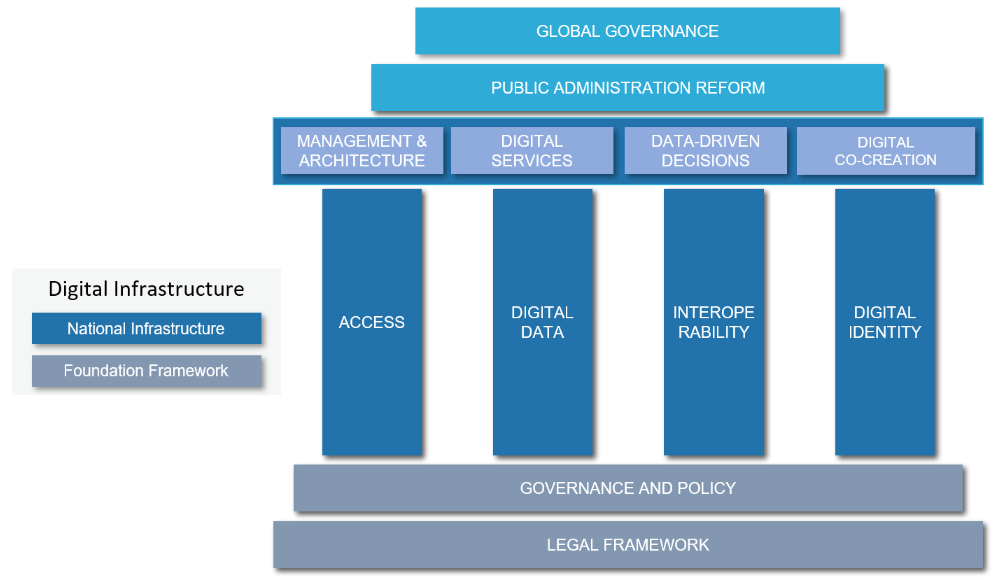

# 3. National Level

## 3.1 Governance & Policy

### 3.1.1 Needs for Governance

Over the past three decades, there have been numerous attempts to integrate information and communications technologies (ICTs) into government operations and services, especially since the widespread availability of low-cost personal computers since the 1990s. This drive towards digitization of government has had many labels over the last three decades, from online government to paperless government to e-governance and m-government, to name just a few.&#x20;

Today, the use of new technologies in public administration is known as digital government. This refers to digitizing all government data and relying heavily on information infrastructure and digitalized information flows in all stages of almost any process. At the same time, a new term of “post-digital era” has come into use.

However, it is essential to distinguish between high-level digitalization strategies that outline general goals, and more tactical infrastructure-oriented digitization plans. Tactical digitization initiatives need to be situated within wider governance reform processes.&#x20;

Merely buying technology does not guarantee improved governance. To be able to transform services digitally in a useful and sustainable manner it is essential to be able to incorporate technology into daily administrative procedures and decision-making. Without these abilities, a digital development plan will not produce the anticipated outcomes or have a significant impact. Set of such capabilities we will also refer to also as a **digital culture**.

Creating digital public service delivery through a GovStack approach requires necessary foundational elements like governance frameworks, legal frameworks, and advanced technologies and software. However, developing a digital culture amongst people creating and using these systems is even more critical.&#x20;

If civil servants do not recognize the importance of utilizing data-driven insights, discussing the concept of smart government or evidence-based governance may be premature. It is necessary to have a basic level of technology adoption before building systems that leverage sophisticated AI-based solutions. Once people understand the value of the internet and data accessibility, it paves the way for further development without any roadblocks.

In situations where the necessary prerequisites are absent, it is essential to cultivate an environment that promotes the growth of digital culture. This cannot be achieved through high-level strategy papers alone, and instead requires civil servants to habitually use new technologies in meaningful ways. For instance, digitalized document management systems should be employed in the day-to-day activities of every given office in a country public sector.&#x20;

When faced with obstacles such as lack of internet access or delays in obtaining logins, it is critical to maintain internal momentum and demand for change rather than allow civil servants to revert to their previous habits of conducting business.

When thinking about governance, one needs to remember some general principles that have been proven over time:

1. There is the need for political leadership. Substantial changes in national and organisational levels need political support expressed through words and budget allocations.&#x20;
2. Changes start to happen when dedicated people and structures make them happen, they collect, keep, and develop the knowledge of digital developments. There is no single recipe for successful digitization drive, however, a dedicated agency with coordination role is an essential ingredient for successful effort.&#x20;
3. It is crucial to understand that governments should refrain from prioritizing building their solutions in-house by arguing that they know what is best for their situation. A government's primary responsibility is to lead. Civil servants should be intelligent purchasers, not IT specialists, except for a few individuals responsible for maintaining the overall data and software architecture.
4. One should also underline the positive role of high-level policies in ensuring the processes run smoothly and guiding the development of organizational-level solutions.
5. It is recommended that a country have an empowered CIO office that systematically develops a digital culture in the public sector.

### 3.1.2 Transforming Governance

Building digital government capabilities is a gradual, step-by-step process rather than a one-time project. The process of cultivating right governance, building legal framework, developing infrastructure and skills must be assessed and subsequently strengthened before attempting large-scale digitization or service delivery reforms.&#x20;

In a nutshell, governance-related issues that affect digitalization in a country can be identified by four distinct indicators:&#x20;

1. **Bad governance choices resulting in extreme centralization in the hope of effective use of qualified human resources** - The creation of services or even homepages for Ministries is sometimes outside the competency of any given Ministry. Instead, it is delegated to the Cabinet of Ministers responsible unit.
2. **Politics prevails over development logic**. It is quite understandable that politics has a different logic and calendar, and it has to be accommodated. However, there is a need for overall awareness of the meaning and lack of data in governance processes and what needs to be done to achieve this.&#x20;
3. **Prevalence of paper-based culture in offices** – public officials in some countries are used to working in the mess of paper trails that enables them to hide mistakes and provide avenues for corruption. Multiple interests always need to be navigated to have the GovStack building blocks meaningfully situated in the overall processes of digitalization.
4. **Security-centric approach** – In many countries, institutions focused on security have control over digitalization, and as a consequence, they often limit data sharing while imposing aspects of surveillance on systems that are meant to uphold participation and democratic decision-making.

These governance issues must be addressed to force digitization on MDA managers. That will lead to better adoption and success of a digital strategy.&#x20;

#### **Digital Culture**

The main goal of the digitalization strategy is to cultivate a digital culture. This involves creating a meaningful work environment incorporating IT development and everyday usage. By doing so, demand for digitization will grow organically, enabling centralized proposals to be implemented successfully and minimizing the risk of process failures.

Political will should drive practical actions that guide daily decisions and escalate unresolved issues. Maintaining political support for digitalization is important for the overall success of the project.

Various strategies and tactics exist for managing change, but the toughest challenge is making people aware of the importance of data. Simply stating that "data is crucial for decision-making" or “data is the new oil” is not sufficient. Instead, processes must be established that highlight the significance of data.&#x20;

Where there is a will, there is a way. Therefore, political will to support digital transformation is the most important aspect of the readiness assessment. We should not forget that oil in the ground becomes valuable only if there is an infrastructure in place to pump it out, refine, and sell it.

#### **Institutional Framework**

The most effective way to manage the technical aspects of digital government is through a whole-of-government approach with centralized coordination of decentralized key initiatives, considering political realities and regulatory frameworks. Various organizational solutions have proven effective, and the following is a brief overview of some of them.

Digitalization Ministry vs Digitalization Agency under the Cabinet of Ministers

Usually, the digitization drive has to emanate in the close proximity to the head of executive power, so the successful cases are Digitization Ministries as in this case they have representation in the form of their own minister. If digitalization is charged to be led by an agency, its power can be measured in its distance from the top executive and the closer, the more chance it has to influence the governance processes and get things done.  &#x20;

Digitalization Committee

To overcome the challenge of multidimensional nature of digitization, one of the working solutions, deployed often, are Digitization Committees, consisting of key Ministers. Such committees meet to decide the funding issues and make recommendations to the Cabinet or the Chief Executive. Usually, they are also initiating and approving new policies and larger digitization projects.

Digital officers in Ministries

Digital has become such a big part of the administration that it cannot be handled alone on the level of technical people in IT departments alone. The whole topic has to be coordinated on the political/decision making level and the best way to either everybody getting proficient understanding and using the principles of digital governance or as a minimum have somebody with this function to advise the office how to integrate the digitalization into the everyday administrative practices.&#x20;

#### **Transformation Strategy**

Conduct assessments to find gaps in legal frameworks, institutional capacity, infrastructure, and skills that need to be addressed.&#x20;

Start building a solid digital foundation by&#x20;

1. strengthening laws that allow for digital governance,&#x20;
2. improving IT infrastructure,&#x20;
3. establishing interoperability standards,&#x20;
4. governing data effectively, and&#x20;
5. enhancing cybersecurity.&#x20;

A digital transformation governance framework should have:

* strong leadership,&#x20;
* comprehensive strategies,&#x20;
* policies & standards, and&#x20;
* coordination mechanisms across the government.

### 3.1.3 Readiness Assessment

Successful implementation of digital transformation efforts requires joint identification and mitigation of risks while building new capabilities where feasible.&#x20;

It takes time to develop digital culture capabilities, which grow through a series of successes. Therefore, it's important to assess a country's level of digital transformation maturity.

When we examine the environment from a technical standpoint, there are clear indicators of low digitalization process maturity:&#x20;

1. Lack of sufficient connectivity.
2. Lack of integrated IT systems in government entities.
3. Lack of digital data.
4. Lack of a wider legal framework for digital processing.
5. Absence of digital payments (i.e., using a bank account or mobile money or CBDC or similar).
6. Absence of national authentication infrastructure and digital signature.
7. Lack of IT literate workforce that can support digital operations.

You should regularly conduct detailed assessments of these and many other indicators to obtain valuable insights for digital strategies and a practical approach to digital transformation.

The key is to recognize that building digital government infrastructure is a long-term, adaptive change process rather than a fixed end state. Regular assessment of maturity levels, gaps, and dependencies provides a crucial perspective. Building progressively from one capability level to the next sustains meaningful and lasting digital transformation.

## 3.2 Legal Framework

### **3.2.1 Principles**

Establishing digital governance requires adapting legal frameworks for digital data flows across public and private sectors to enable secure e-government and e-business.&#x20;

Foundational regulations organizing digital data flows and creating necessary preconditions for government action in digital service provision like e-signature laws, data protection, and cybersecurity standards provide validity, privacy, and security for online transactions and allow the protection of foundational governance principles in the court of law.

Laws and policies promoting user-friendly digital interfaces between citizens and government systems are needed for transparent and efficient e-services. Also, you have to recognize the primacy of electronic documents and transactions. However, the shift from paper documents to digital-only processing can be challenging. Enabling the primacy of digital records is a key issue that every country needs to address.

Carefully adapted laws aligned with overarching e-government goals are needed for societal digital transformation. Regulations should be flexible enough to accommodate emerging technologies and facilitate sustainable, future-proof digital governance.

Digital government regulations should also embed a few fundamental digital society principles to align governance with user needs and societal goals:&#x20;

* The '**once-only**' principle means citizens and businesses provide data only once to the government, enabled by interconnected databases and digital ID laws.&#x20;
* '**Digital by default**' makes online services the primary channel, facilitated by recognizing electronic transactions.&#x20;
* '**No legacy policy**' involves not digitizing legacy paperwork but reengineering processes for digital optimization as well as keeping systems and technology platforms up to date, thus enforcing security by design concept.&#x20;
* **Openness** and transparency principles require updated access to information and data protection laws.&#x20;
* **Privacy** regulations (e.g. GDPR) ensure confidentiality in digital systems.
* **Human rights in the Digital Era** for all population groups, as a fundamental starting point, ensuring that human rights apply online as they apply offline. This creates conditions for reducing abuse by the government, equitable distribution of benefits, and the realization of fundamental human rights in the digital era through the use of digital government without discrimination.

Overall, e-government legislation should institutionalize such principles to drive simplified, user-centric digital services focused on value creation rather than technology per se. Embedding principles in the legal framework creates obligations and incentives for administrators to apply them in practice. Regulatory guidelines can also recommend interpreting principles when implementing digital governance initiatives.

Also, focusing on general regulation and technology neutrality principles when implementing legal reforms is better than overly specializing in e-government legislation. This approach allows for a more integrated and innovative digital governance that prioritizes user needs over specific technologies. It also ensures the realization of human rights in the digital era for all individuals residing within the state's territory, including citizens, stateless persons, foreign nationals, refugees, and other categories of individuals.

### 3.2.2 Process

Here are key regulation process attributes to apply for developing good digital governance regulatory frameworks:

* Consultation - Consult relevant stakeholders like government agencies, the private sector, civil society groups, and citizens when drafting regulations.
* Transparency - Make the regulatory processes and decisions openly accessible and clearly communicated.
* Evidence-based - Develop regulations based on a rigorous assessment of available data, research and impact evaluations.
* Risk-based approach - Prioritize addressing real-world risks and challenges through regulations.
* Future-proofing - Build adaptability for regulations to accommodate emerging technologies and changing contexts.
* Technology neutrality - Focus regulations on desired objectives rather than specific technologies which keep changing.
* Accountability - Clearly define institutional mandates, roles and responsibilities for implementing regulations.
* Review mechanisms - Build systematic processes to periodically review, evaluate and update regulations.
* Proportionality - Balance regulatory costs and burden against expected public benefits.
* Outcome orientation - Structure regulations towards achieving real-world impacts and goals.
* Gradual building of Compliance - Support regulated entities in understanding and complying with regulations.

### **3.2.3 Roadmap**

The digital transformation process in government differs from that in the private sector, mainly due to the requirement for a legal basis for all government activities. While government policy documents can provide some guiding principles, it's crucial to establish them in legal text, which is the law.

There are several ways to approach this and clearly, only some of the laws are necessary for all the parts of GovStack components to be implemented successfully. For the ease of understanding, we have grouped them here in general topics. The ways the laws are drafted depends on a given country’s legal traditions; thus, it is impossible to list them by titles and provide ready-made texts. However, some of the laws that are expressing well debated technical solutions can be almost copied from best examples around the world and for some, similar countries can orient their own law drafting to the experience of others.&#x20;

In the sake of clarity, we have followed the necessary functions of government that wants to become digital in the groupings in the legal toolbox. The titles can vary and the content as well, but these functions should be offered legal basis for the overall success of digitalization.

Fundamental legal norms established in the forms of domestic and international law in the sphere of human rights in the digital era and human rights:

* Universal international legal treaties, principles, and customs concerning human rights and human rights in the digital era.
* Regional international legal treaties, principles, and customs concerning human rights and human rights in the digital era.
* National constitutional acts that enshrine basic human rights and human rights in the digital era (for example, in Estonia, access to the Internet is considered a human right), establishing basic rights to not only access the internet but also access to modern digital technologies of Industry 4.0 and their benefits.
* Federal constitutional laws that enshrine basic human rights and human rights in the digital era.
* Federal laws (including Codes, Foundations of Legislation, Laws on Ratification and Denunciation of International Treaties) that enshrine basic human rights and human rights in the digital era.
* Subordinate legislation: 1) Decrees of the head of state as provided by the Constitution or other fundamental national documents; 2) Government resolutions; 3) Departmental acts; 4) Acts of executive authorities of federal subjects.

1. Foundational laws enabling e-governance ( T. Kerikmäe (ed.), Regulating eTechnologies in the European Union, DOI 10.1007/978-3-319-08117-5\_3: e-Governance in Law and by Law, The Legal Framework of e-Governance by Katrin Nyman-Metcalf (as basis of)) and digital data flows:
   1. Legal framework recognizing electronic documents, signatures, and transactions as valid and binding, such as e-signature laws
   2. Laws enabling digital identification methods for individuals/businesses to securely interact with government online
   3. Legal recognition of electronic transactions, payments, billing and invoicing
2. Privacy, security, and risk management:
   1. Data protection and privacy laws regulating collection, storage, use and sharing of personal data, including in interconnected databases
   2. Cybersecurity laws setting standards for protection of government IT systems and data
   3. Intellectual property regulations for government data and digital services&#x20;
3. Openness, transparency, and access:
   1. Access to information/freedom of information laws facilitating proactive disclosure and access to government data and documents
   2. Regulations on use of emerging technologies like artificial intelligence, cloud computing, and blockchain in government
4. Institutional organization, standards, and oversight:
   1. Organizational and institutional mandates clarifying roles, responsibilities, and oversight for e-governance initiatives
   2. Interoperability frameworks and open standards to allow connectivity between government IT systems &#x20;
   3. Competition regulations adapted for e-government public-private partnerships
5. Digital service delivery:
   1. Administrative laws and procedures adapted for electronic administrative processes and digital service delivery
   2. Laws on digital archiving and records management for electronic documents and data
   3. Rules for electronic procurement, tendering and contracting&#x20;
   4. Laws facilitating electronic voting and other e-democracy initiatives, where applicable

## 3.3 Digital Infrastructure

### 3.3.1 Overview 

Digital transformation of the public sector should enable better user experience and reliable legal digital transactions. For secure and resilient delivery of public digital services, a certain level of Digital Government Infrastructure should already be in place (for details, see section 2.5 above):

<figure><figcaption>
Figure 8 - Digital Governance Model (Source: Ivar Tallo &#x26; Aare Lapõnin)
</figcaption></figure>

Digital Governance Infrastructure consists of a Foundation Framework Digital Infrastructure Pillars.

Foundation Framework contains:

* governance,&#x20;
* policy, and&#x20;
* legal components.

Four Digital Infrastructure Pillars such as

* Access
* Digital Data
* Interoperability
* Digital Identity

Following is description of required level of maturity for those components to enable digital transformation of public sector.

### 3.3.2 Principles & Policies

The digital governance policy should focus on to national coordination, capacity building, data and technology governance, iterative piloting, and stakeholder engagement for digital transformation.

#### General guidelines

Following are key recommendations from international for digital government policy frameworks:

* Develop a national digital or e-government strategy with vision, priorities, and implementation roadmap (EU, OECD, ADB, UNDP)
* Establish centralized coordination of digital government efforts (EU, OECD, WB)
* Develop policies and standards for digital services, data, shared platforms, interoperability, and cybersecurity (EU, OECD, WB)
* Institute governance frameworks specifying institutional roles and responsibilities (OECD, WB)
* Develop national laws or amend existing ones (including constitutions) to incorporate human rights in the digital era, such as access to the internet and Industry 4.0 technologies, as well as the benefits derived from such technologies, into digital or e-government strategies.
* Develop digital capabilities and skills within government (EU, OECD, WB)
* Pursue public-private partnerships and engagement with startup ecosystems (EU, OECD, WB)
* Develop guidelines for use of emerging technologies like AI in the public sector (OECD)
* Leverage digital technologies at all stages of policymaking (OECD)
* Undertake piloting and iteration in digital government innovations (UNDP, WB)
* Develop guidelines for digital procurement and platform business models (WB)
* Promote whole-of-government and government-as-a-platform approaches (EU, WB)
* Develop legislation for digital identity, data protection, cybersecurity etc. (EU, WB)
* Commit to principles of openness, transparency, and public participation (UNDP, OECD)
* Continuously evaluate policies and update based on latest trends and feedback (ADB)

#### Principles

Regulations and policies should adhere to the following principles:

1. Rule of law based on the priority of human rights and the SDG set by the United Nations. The rule of law is a fundamental governance concept that pertains to the idea that everyone, including individuals, institutions, and governments, is subject to the law and accountable under it. In modern terms, this means that a state should be governed by a system of international and domestic law rather than arbitrary decisions or whims of those in power. In this context, the law should be understood as a system of principles and norms aimed at realising human rights, particularly human rights in the digital era, shaping a human-centred state, eliminating barriers that may arise with new technologies and minimising state abuses. A modern digital state should be human-centric. Legal regulation of the digital environment related to human rights will ensure that technologies serve the benefit of every individual, enhance trust in digital service systems among the population, and minimise abuses (for example, excessive data collection, discrimination, and human rights violations). This will increase public engagement in state development and enhance trust in the system.
2. Whole of government - The principle refers to an approach in governance where all government agencies, departments, and ministries work collaboratively and cohesively towards achieving common goals and objectives. This approach recognises that many complex issues and challenges societies face require coordinated efforts across different sectors and levels of government. Systems and services should interoperate by design to deliver integrated services across agencies.
3. Digital by Default - Public services should be delivered digitally as preferred. Traditional channels remain available, but digital should be primary.
4. No-legacy - rethinking and redesigning processes from scratch to take full advantage of technology and be "digital native".
5. Once Only - Citizens and businesses should only have to provide information to the government once. Data should be reusable across agencies. Public organisations should share information proactively. Processes and decision-making should be transparent.
6. User-Centric Government - Services should be designed around user needs and experience. Governments should adopt an outside-in perspective.
7. Natural Digital Environment - Public administration should aim to deliver digital services directly to customers' natural digital environment.&#x20;
8. Public and Private Sector Co-creation – Public administration should engage the private sector in the process of co-creation of public sector digital services on a beneficial private sector basis.
9. Cross-Border by Default - Services should cater to citizens' needs regardless of location.
10. Intrinsic Security & Privacy - Security and privacy should be embedded into systems immediately, not as an afterthought.

#### Policies

Policies are a great way for the government to communicate their goals in a way that everyone can understand, as opposed to using legal language in legislation which can be difficult to comprehend.&#x20;

Policies introduce new concepts and provide context to help explain them. While there can be many different policies, there are a few that are essential for successful digitization efforts.&#x20;

Digitalization policy

Summarizing the dynamics of digitization drive of the government, the major responsibilities and expectations the government has vis-a-vis the initiative its entities toward digitization, what citizens, government and society at large can expect to be achieved if this direction is upheld. It also usually caters to access questions and formulates overall goals for other policies like once-only for services and creation of a digital data ecosystem.&#x20;

Policies

Policies are a great way for the government to communicate their goals in a way that everyone can understand, as opposed to using legal language in legislation which can be difficult to comprehend.&#x20;

Policies introduce new concepts and provide context to help explain them. While there can be many different policies, there are a few that are essential for successful digitization efforts.&#x20;

#### Digitalization policy

Summarizing the dynamics of digitization drive of the government, the major responsibilities and expectations the government has vis-a-vis the initiative its entities toward digitization, what citizens, government and society at large can expect to be achieved if this direction is upheld. It also usually caters to access questions and formulates overall goals for other policies like once-only for services and creation of a digital data ecosystem.&#x20;

#### Digital services policy&#x20;

The efforts of directing/doing all services from one office have shown not to work too well, the business processes are simply too different. However, there should be harmonization of efforts, so primary suggestions as user centricity or once only or multichannel approach, etc could be put forward and explained in that type of policy. &#x20;

#### Data Policy&#x20;

Data Policy’s prime purpose for the government is to move from analogue to digital mode of operation and to establish the primacy of digital data over paper-based records. For that to happen, there must be a shift to trust the data in government databases. Government has to establish the precise rules for the databases and registers, how they are created, who can run them on behalf of the government and how the data is collected and kept in the digital age. One of the hardest debates in any government is how different data is priced and who has the right to use it.&#x20;

#### Data protection policy

Data protection topic is treated differently in different cultures. However, the basic substantive principles as well as the way they are approached are quite similar. If there is no data protection legislation yet or if there is some 15-20 years old law, it would make sense first to articulate the current demands coming from digitalization drive as opposed to traditional treatment from the time when personal data protection was more concerned with potential government violations as opposed to current public-private interactions, private sector data protection issues, cross border data flows, and technical ways of addressing variety of data protection concerns and political concerns that come from the desire of the private companies to participate in large markets like the EU Common Market where there are strict data protection rules in force and these rules are applicable to all outside participants also. &#x20;

#### Cyber security policy

Cyber security has evolved over the last 15 years from a niche exercise into one of the most critical areas of digital activities. When any country is embracing digital journey seriously, there is a need for basic statements of intention on cyber security. It is necessary to situate the cyber security activities into the overall digitization effort and as stated above, find a logical timeline to deal with these issues. First, if digitalization is still in the initial stages, cyber security concerns can be kept in mind but no serious budgetary claims to this area should be honoured. Second, there is a need to situate the cyber security concerns in government structures correctly.&#x20;

There are usually three types of claims made by different participants to own these processes. First, there is the question of network protection issues that are typically addressed with CERT/CSIRT type of organizations whether private or public. Second, there are traditional issues of physical network protection and how to best accomplish this, whether and to what extent a government needs to use private networks or could they utilize public networks and protect only data belonging to the government. Third, there are concerns about critical information infrastructure protection. They appear when governments start to rely on their functions to the&#x20;

So traditionally there are three parties interested in taking lead: security organisations, defence organisations and digital/economy ministries. The cyber security policy needs to sort out how the given government wants to approach these topics.&#x20;

#### IT procurement policy

IT procurement needs are different from those of finite goods or services as there is constant technological development and procurement should support the development needs of the administration when formally the rules have to prevent different forms of corruption. The development of some IT elements, like interoperability platforms could take years. At the same time, IT developments are path dependent, I.e., if there is a choice of certain products, it is difficult to switch to alternative products and one has to be aware of the problems that these features cause in the overall development process and how to address them.

Digital services policy 

The efforts of directing/doing all services from one office have shown not to work too well, the business processes are simply too different. However, there should be harmonization of efforts, so primary suggestions as user centricity or once only or multichannel approach, etc could be put forward and explained in that type of policy. &#x20;

### 3.3.3 Building Infrastructure

#### **Whole-of-Government**

The SDG Digital Investment Framework offers a comprehensive approach to help organizations break down silos from a technical perspective. This cross-government view allows for a methodical approach to making digital investments. The framework provides a compelling rationale for enterprise planning and funding reusable platforms, registries, workflows, and policies.&#x20;

This approach shifts traditional silo-based thinking and investments, enabling a citizen-centric and whole-of-government digital transformation. It's important to identify shared services, workflows, and data to meet the needs of multiple agencies and sectors, consolidating duplicated services and eliminating duplicate data through interoperability.

The working environment of government organizations differs significantly from that of private enterprises. In government agencies, decision-making is often guided by political considerations, complex hierarchical structures, and various relationships, unlike in private companies. Thus, resolving competency and responsibility issues is usually more critical than ensuring technological solutions are appropriately aligned. That is why the whole-of-government approach often encounters substantial opposition and challenges.

#### **Chicken-egg problem**

It takes time to implement the comprehensive set of preconditions. You may face the chicken-and-egg issue: why would someone invest in Digital ID, for example, when there are no digital services available? In ministries and departments, you cannot build personalized services without universal national digital identification capacity. What can be done about this?

It is therefore a good idea to use a two-tier approach:

* Target the foundational elements.&#x20;
* Make some quick wins that help demonstrate the benefits of the chosen path to both political leaders and the public.

The incremental building of capabilities and digital readiness allows for managing the complexities of digital transformation.

The pragmatic approach will first focus on improving connectivity, instituting IT management capacity, and nurturing digital culture within government organizations.&#x20;

Once the basic infrastructure is in place, introducing digital document and data management systems should catalyze the initial shift away from paper-based processes.&#x20;

With the initial foundation solidified, the next stage should involve:

* digitizing public sector back-office operations and transactions, i.e., pursuing quick-win projects early on to demonstrate tangible benefits and impact, building momentum for more significant initiatives (priority use cases).
* delivering omnichannel self-services focused on user needs, and&#x20;
* developing data management platforms to support decision-making processes, i.e., digitizing existing processes and transactions to enable digital delivery of high-volume citizen-government interactions. If most of the data is in traditional paper format, digitizing existing paper-based documents in use is necessary.&#x20;
* Develop basic national digital infrastructure standard services like digital ID, payments, and legal data registries.&#x20;

#### **Transforming Services**&#x20;

Use user-centered service design principles to transform public services around user needs for an integrated omnichannel experience.&#x20;

Build skills and culture for user-centric governance through extensive training programs, especially retraining public servants.&#x20;

When undertaking reforms, manage change through stakeholder engagement, communication, and participatory approaches.

**Manage Data**

Today, it is widely recognized that organizational data is an important asset. Data and information can provide insights into customers, quality, needs, and services, which can help organizations innovate and achieve their strategic goals. Despite this recognition, only a few organizations take steps to consolidate all available data and use it actively on a daily basis.

Deriving value from data requires intention, planning, coordination, and commitment. It requires data management. An organisation should establish data management, i.e., the development, execution, and supervision of plans, policies, programs, and practices that deliver, control, protect, and enhance the value of data and information assets through their lifecycles.

**Driving Adoption**

Build, test, and refine digital services using an agile, iterative approach based on continuous user feedback and data insights.&#x20;

Collaborate with the private sector and civil society via partnerships, hackathons, and open government data initiatives to drive co-creation and adoption.&#x20;

Review progress periodically, share lessons across government, and update strategies based on the latest trends.

#### **Sustaining Innovation**

Pursue a whole-of-government approach to digitalization for integrated services across agencies but allow flexibility for contexts of different departments.&#x20;

Institutionalise mechanisms for periodic reviews and incremental improvements in policies, regulations, and technologies.&#x20;

Share best practices across government and with other countries to sustain continuous innovation as technologies evolve.

Also, to some degree, "allow to fail" is important. You learn from failed projects. If you always fear failure, you will probably never do anything at all.

## 3.4 Foundational Pillars

### 3.4.1 Access

#### **Example of electricity**

William Gilbert's book, De Magnete, published in 1600, distinguished between the lodestone effect and static electricity produced by rubbing amber. He coined the word electricus, which led to the creation of the English words "electric" and "electricity." Only, during the late 19th century, notable individuals, such as Alexander Graham Bell, Thomas Edison, Nikola Tesla, and George Westinghouse, made significant contributions to electrical engineering, transforming electricity from a scientific curiosity into a crucial tool for modern life. Electric lighting became common only in the early 20th century.

It took 300 years to develop and make accessible an alternative to candles for people. We must ensure that digital services become available to everyone within a **much shorter period**.

Enabling nationwide access to digital services needs a holistic approach that simultaneously addresses infrastructure, education, policy, and societal requirements.

Here are the main components needed for that.

**Infrastructure**

Reliable electricity is a prerequisite for digital services. Therefore, improving the electrical grid and exploring renewable options like solar power can be crucial.

Invest in broadband infrastructure to provide high-speed internet access across urban, rural, and remote areas.&#x20;

Enhance mobile network coverage to include 4G/5G technologies to ensure widespread internet access. This could involve using satellite connections, mobile broadband, or other technologies suited to remote regions.

Affordability can be improved by providing subsidies or affordable plans for low-income households to access digital services and by offering incentives to internet service providers to extend services to less profitable areas.

#### **Education**

Digital literacy and education are crucial enablers for the digital transformation. To promote digital education and awareness, the following steps can be taken:

* Training Programs: National digital literacy programs can be implemented to educate people about the benefits of digital services.
* School Curriculum: The younger generation can be made digitally literate by integrating digital skills training into the school curriculum.&#x20;
* Awareness: To encourage adoption, run promotional campaigns and provide assistance and incentives for transition to digital platforms.
* Socio-economic barriers: identify and address inequality by reducing socio-economic disparities that may hinder access to digital services.&#x20;
* Internet Kiosks: set up community internet access points or digital kiosks in areas with low private home access.

**Policy**

It is crucial to build human capacity in ICTs through education, infrastructure development, and international internet bandwidth expansion.

To establish inclusive and transparent digital transformation governance, you need to:

1. Establish a centralised authority responsible for driving the digital governance agenda.
2. Engage with stakeholders (citizens, NGOs, and the private sector) to ensure digital services meet everyone's needs.

To build trust in digital services, enact strong data protection and privacy laws and establish robust cybersecurity frameworks to protect against cyber threats. Implement secure and verifiable digital identity systems that can be used to access public services.

Encourage collaboration between government, private sector, and non-profit organisations to expand digital services and stimulate investment in digital technologies and infrastructure.

Invest in research and development in the digital sector to foster innovation and support start-ups through incubators, grants, and mentorship programs. Across the globe a tech start-up ecosystem is expanding rapidly, attracting significant investment in sectors like FinTech, AgriTech, EdTech, and HealthTech. Diversification in services offered by start-ups contributes to economic development and innovation.

Develop KPIs and metrics to measure digital service uptake and impact. Implement feedback systems for continuous improvement.

#### **Social Requirements**

It is important to note that simply automating existing business processes may not provide any significant benefit to citizens or businesses. It may only result in some efficiency gains for the internal staff of public administration organisations. This can be seen as a good first step towards building the capacity to transform, but it is only a start.&#x20;

Eventually, the goal should be to achieve a real transformation of existing processes while keeping in mind the desired outcomes by fully redesigning internal processes and implementing the Once-Only and Digital-First principles.

Use design thinking to ensure digital services are easy for people of all digital skill levels. Additionally, one should adhere to accessibility standards to make our services usable for people with disabilities.

It is important to provide digital services in multiple languages to cater to diverse linguistic groups within the nation.

Promote mobile financial services and develop digital platforms for government services to encourage digital economic inclusion. Actively explore digital financial services to enhance financial access through mobile money and central bank digital currencies. Mobile money has played a significant role in financial inclusion by enabling accessible digital payments and transfers without the need for physical banks.

Enhancing digital infrastructure, technology adoption, and financial services can drive economic growth, structural transformation and prosperity.

Telemedicine services can extend healthcare access to remote areas. Digital services can provide farmers with information on markets, weather, and farming techniques. Targeted programs can encourage and support women and girls in using digital technologies to address the gender digital divide.

Collaborate with community leaders to increase digital adoption and address any cultural resistance.

### 3.4.2 Digital Data

#### **Data Management**

A country's digital transformation has a significant impact on governance, particularly on data management. We have a well-established system for handling paper-based documents and information, including the infrastructure for creation, dissemination, usage, and retention. This system is deeply ingrained in our societies and taught in schools, universities, companies, and the public. However, when we shift from paper to digital data, we need to create a similarly comprehensive and solid infrastructure that can handle digital information on a societal-wide level.

Specific policies required for data management in a country to facilitate digital transformation should at least include the following elements.

**Data privacy regulations**, such as the General Data Protection Regulation (GDPR) in Europe, play a crucial role in governing personal data collection, processing, and storage. These regulations ensure that individuals have control over their personal information and that organisations handle it responsibly. By implementing these laws, a country can ensure that anyone who processes data will comply with the legal requirements and foster trust with their customers.

Establishing **standards** and regulations for data security to protect against unauthorised access, breaches, and cyber-attacks. This may involve encryption protocols, authentication mechanisms, and regular security audits.

Data **localization** law sets rules on where data can be stored and processed, including requirements for data to be kept within national borders or specific regions to protect sensitive information.

**Open Data** policies promote transparency, collaboration, and economic growth by encouraging government agencies to make non-sensitive data available to the public for analysis, research, and innovation.

**Interoperability** standards and protocols will enable different systems and platforms to exchange data seamlessly. Interoperability facilitates integration, data sharing, and collaboration across various sectors and organisations.

Creating mechanisms for **sharing data** between public and private entities while ensuring privacy, security, and compliance with regulations can foster collaboration, innovation, and the development of new services and products. The should be no fees for sharing data amongst governmental agencies.&#x20;

Establishing frameworks for managing and governing data throughout **its** **lifecycle**, including policies for data quality, metadata management, access control, archiving, and compliance.

**Capacity building** initiatives to enhance the digital skills and data literacy of citizens, businesses, and government officials will ensure knowledge and expertise to manage and leverage data for digital transformation effectively. Investing in capacity building is a prerequisite for the success of data-driven projects.

**Incentivizing** data innovation by offering tax breaks, grants, or funding programs will encourage businesses and organisations to invest in data-driven innovation and technology adoption. Also, state agencies should enable depersonalised data in a sandbox to facilitate product development by start-ups.

Developing **ethical guidelines** and frameworks for responsible use of AI and data analytics to address bias, fairness, transparency, and accountability in decision-making processes.

Such policies and frameworks will enable digital transformation without jeopardising it through the risk of losing data (prioritizing the realization of human rights in the digital era in the context of AI design, development, implementation).

#### **State Registries**

State registries play a critical role in the governance, administration, and service delivery mechanisms of a country. They are centralized databases that maintain up-to-date records on various aspects such as population, businesses, property, vehicles, etc. Following are main reasons, why it should part of the national digital infrastructure enabling digital transformation.

**Authoritative Source of Information**: State registries serve as the official source for various types of data, ensuring that government agencies and departments have access to accurate and reliable information for decision-making, policy formulation, and governance.

**Efficient Service Delivery**: By having centralised registries, governments can streamline the delivery of public services. For example, a registry of citizens can expedite processes like issuing identification documents, voter registration, and providing social services, thereby enhancing the efficiency of government services.

**Improved Data Management**: Centralized registries enable better management and control of data, ensuring that information is consistently updated and maintained. This reduces duplication of data across different government entities and minimises inconsistencies.

**Enhanced Transparency and Accountability**: State registries contribute to greater transparency by providing a clear record of transactions, ownerships, and registrations. This is particularly important in areas like property registration, where clear records help prevent fraud and disputes over ownership.

**Facilitation of Legal and Regulatory Compliance**: Registries help ensure compliance with laws and regulations by maintaining records of registrations, licenses, and other legal documents. This is instrumental for business operations, vehicle registration, and real estate transactions.

**Support for Economic and Social Planning**: The data contained in state registries is invaluable for planning and research purposes. It allows governments to analyse trends, make informed decisions on infrastructure development, public service needs, and social programs, and monitor the effectiveness of policies.

**Public Health and Safety**: Registries for vaccinations, health records, or criminal records are vital for public health management and safety.

See list of most important state registries in the Appendix 3.

### 3.4.3 Interoperability

#### **Overall approach**

The public sector architecture follows a distributed model. This empowers government agencies to be independent yet integrated. Agencies can choose their systems and partners while benefiting from centralised governance and standards that enable efficient, secure, and scalable systems.&#x20;

Taking a whole-of-government approach that balances standardisation with flexibility will provide a digital ecosystem that serves citizens seamlessly while giving institutions autonomy.

The interoperability infrastructure should establish legal certainty and trust by enabling once-only data collection from citizens and strong data lineage across all systems. Cyber resilience is ensured through distributed security measures rather than having a single point of failure.

The interoperability platform for information exchange between systems should be fully decentralised implementing the following key aspects:

* Information exchange is always between the receiver and submitter without any centralized party in between.
* Organisational sovereignty of participating in information exchange members is not compromised retaining administrative responsibility to data owners and users.
* There is clear data lineage supported by PKI-based logins.
* There is cyber resilience supported by encryption and access rights management.
* It avoids a single point of failure through distributed data.

#### **Governance**

To achieve optimal efficiency and scalability of an interoperability platform that relies fully on distributed implementation, certain principles must be observed:

* Centralized oversight and coordination if interoperability requirements implementation across all governmental organisations.
* Standardization of security policies, software, and protocols for data exchange.
* Mandatory verification, testing, audit, and certification to ensure compliance.
* Governmental central agency should operate usage monitoring and permissions management; that should ensure legal certainty.

#### **Administrative procedures**

There should be a procedure that ensures the trust and interoperability of participants. The owner of the procedure should be the central governmental agency. The following aspects should be covered:&#x20;

1. Application – members should apply to Central Authority to join interoperability platform describe planned information system, data content and usage intent.
2. Verification - The authority verifies the application and ensures the planned system meets security and interoperability standards.
3. Agreement - An agreement is concluded between Authority and the information system owner outlining rights and obligations.
4. Installation - Authority provides standard interoperability member’s software and assists with configuration.
5. Testing - Extensive testing is done to validate correct functioning before moving to production.
6. Security Audits - Regular security audits are conducted by all participants.
7. Usage - The information system owner access data and share information with other systems based on principles and regulatory framework.

At an institutional level, decentralised interoperability platform empowers government agencies to be independent yet integrated. Agencies can choose their systems and partners while benefiting from centralized governance and standards that enable efficient, secure, and scalable interoperability.&#x20;

### 3.4.4 Digital Identity

Digital identity is a key enabler of secure and trusted digital services and transactions between governments, organizations, and individuals. At its core, digital ID provides authentication and digital signature capabilities that allow legal validity like handwritten signatures.

While approaches like self-sovereign identity or federated functional identity are around, they currently face adoption challenges due to legal uncertainties and technical complexities. For legally binding digital identity and signature solutions, a foundational ecosystem model is advisable.

The digital signature and identity ecosystem have layers:&#x20;

#### **Legal Framework**

It is needed to properly regulate and operate every aspect of the ID ecosystem. A comprehensive legal framework like eIDAS in the EU establishes standards for digital identity, electronic signatures, electronic seals, time stamps, and more. This provides the regulatory basis for digital ID ecosystems to ensure legal compliance. However, every government and situation may require slight adjustments to ensure success.

#### Identity Provider&#x20;

Identity provider(s) enroll and verify real-world identities into the digital system (civic registry). This can be government bodies or authorized private providers. Enrolling digital identities into the ecosystem requires in-person verification and the ID issuance process in many cases. In the case of fundamental ID, it should be issued, governed, and maintained by government authority or by a service provider appointed by authority. In ideal case the ID issuer should be the same authority that is responsible of issuance of passports, to ease the legal validity question of digital ID. Thus, here below is an example of civic registry, vital statistics, and identity management system overview, recommended by UN. The civic register with all its components will play a crucial role as a base information for the rest of the ID ecosystem layers.&#x20;

<figure><figcaption>
Figure 9 CRVS platforms, Key Findings for Practitioners by UNICEF; graph developed by UN Legal Identity Expert Group (LIEG)
</figcaption></figure>

#### Identity Token

The identity token is a cryptographic container that stores digital keys for authentication, digital signing, and encryption. It can be based on smart cards, mobile apps, SIM cards, etc. Having multiple tokens running in one ecosystem provides additional resilience for token failures and allows users to switch between solutions that are most suitable for their use case, thus providing flexibility. These tokens can be provided by private sector providers, and it is advisable to create a competitive market.

#### Certificate Authority

Trusted certificate authorities validate user identities and bind their identity to their cryptographic keys by issuing digital certificates. Multiple CAs can exist within the ecosystem as per the legal framework. This prevents vendor lock-in and will boost rollout.&#x20;

#### User Software&#x20;

Software tools enable integration with business workflows to allow digital signing, verification, and authentication. Opting for open standards and open-source software enables ease of adoption. Customizable solutions cater to specific needs.

All these layers are necessary for a comprehensive and proven digital ID ecosystem. Technically, there are multiple ways to address these aspects, but building blocks and open-source approaches are essential for government sovereignty and system sustainability.

Many governments struggle with digital ID and signature deployments due to low citizen participation. A recommended solution is to develop a "killer-service" that everyone needs and wants to use. Collaboration with the private sector for cross-domain use cases, such as using government-provided digital ID as an authentication method for banking services, enables legally binding client data in digital format while outsourcing authentication process risk management to the government. These types of solutions are win-win and can boost and ease the solutions take-up. &#x20;

\
