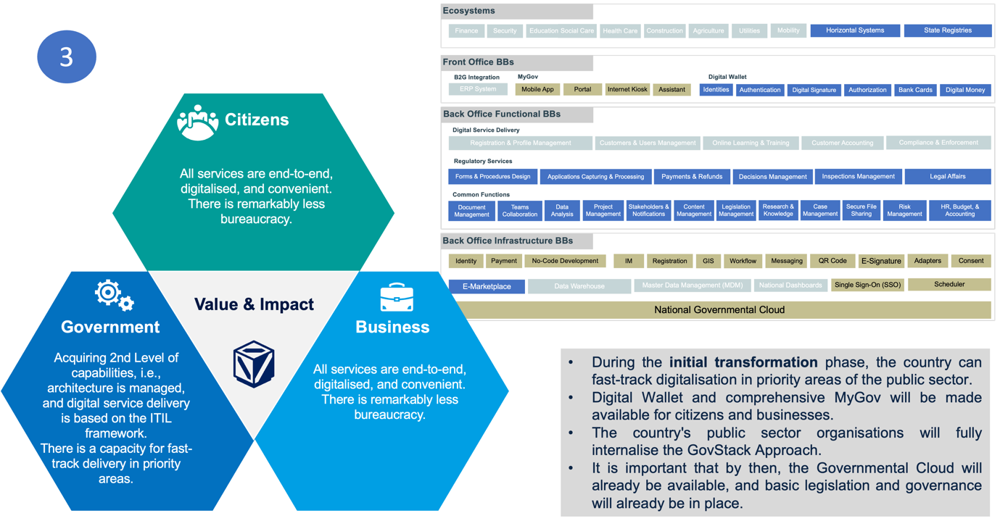

# 5. Implementation Framework

## 5.1 Capabilities Assessment

An organisation's ability to transform itself into a digital organisation cannot be achieved simply by command or by assigning a budget. It can only be acquired through the internalisation of successful implementation of modernisation projects and digitalisation initiatives. Therefore, it is essential to consider the organisation's maturity level when creating a roadmap for its transformation.&#x20;

A model of maturity levels shows a realistic and practical sequence of developing internal organisational capabilities:

<figure><figcaption>
Figure 21 - Organisation digital transformation capability model (Source: Aare Lapõnin)
</figcaption></figure>

Our experience shows that organisations should start from the ground floor and gradually move from one level to another. Practically speaking, it is not possible to “skip” a level.

We explain this diagram by describing each step of the maturity levels diagram.

#### Ground floor

If an organisation has never implemented any automation project, we can say that it is on the ground floor.&#x20;

The ground floor, in terms of capabilities, means:

* The management did not plan for IT systems to deliver services or support activities.
* There is no organisational architecture document that describes the business, data, application, and technology used by an organisation.
* An organisation does not deliver digital services to external customers.
* Management is not using its operational data systematically to make decisions regarding strategic options for the organisation.
* The organisation has never procured IT system development and management services from a market.

Once you are on the ground floor, you should:

* Make sure there is connectivity for your organisation and your customers.
* Start with small projects, which should have a small budget and delivery timeline, at most 6-9 months.
* Prepare plans for how users will be trained to use the new system, what administrative procedures you need to support a new way of working, and how the latest IT system will be supported.
* Start cultivating a digital culture in an organisation (see 3.1.2 above for details on a digital culture).

Following important rules should be considered:

1. A New IT system is a liability, and you have to plan maintenance costs for the entire lifecycle of the planned solution.
2. There will be digital data, and you should have procedures for managing the lifecycle of the digital data.
3. There should be a unit in charge of digital transformation that is able to report and escalate to the management of the organisation.

It is important to note that if the staff has experience in digital transformation from other organisations but has yet to deliver any project as a team, then this organisation starts from the ground floor.

#### 1st Level – Trust of Data

An organisation achieved the 1st floor if the following is true:

1. Management: There are regular planning activities where management assesses and commits to proposals to invest in IT projects to improve operations. Management cultivates digital culture in the organisation.
2. Architecture: There is a process in an organisation to maintain documentation of business services, processes, data, applications, integrations, and technology components. This is known as the architecture management process, and it aligns the organisation’s business and IT staff.
3. Digital Services: The organisation is delivering digital services to external customers. For that, there is an IT development, maintenance, and ITIL-compliant IT service management capability. Also, the design and operation of digital service delivery is done as a collaborative effort between business process owners and IT.
4. Data-driven Decisions: The organisation consolidates all its data, including logs and monitoring metrics, in a reliable enterprise data warehouse (EDW). They use management dashboards and reports for operational and strategic decisions, and EDW is accessible through self-service analytics to all analysts in the organisation. For all data, metadata describes the semantics of available data. There is a data quality management process. The organisation trusts the quality of data. The organisation is in the process of learning to make decisions based on data.
5. Digital Co-creation: The organisation can procure different services from the market to ensure high-quality digital service delivery. There are channels for consultation with customers to receive feedback regarding the quality of digital service delivery.

Once you are on the 1st floor, you should:

* Continue with small projects, which should have a limited budget and delivery timeline, at most 12 months.
* Prepare plans for the complete digitalisation of all activities in the organisation. Often, such plans can be formulated as an organisation's IT strategy, and it should cover a 3-5 years time period.
* Establish a comprehensive enterprise architecture repository for detailed planning of modernisation initiatives.
* Introduce a dedicated Enterprise Architecture management team to ensure IT and business alignment.

#### 2nd Level – Process Management

An organisation achieved the 2nd floor when all indicators of the 1st floor are fully accomplished and additionally, the following is true:

1. Management: There are service level agreements (SLA) established for every business service, which is delivered to external customers. SLA levels are regularly reviewed by management, and in case of deviations, corrections are implemented. For every internal business process, there are key performance indicators (KPIs) established and regularly monitored by management. In case of deviations, corrective actions are implemented. There is a process of continuous analysis of changes in the internal and external organisational environment. The result of this analysis is proactively used for planning changes needed for improvements of quality services and efficiency of business processes. This process is known as strategic management, and it is fully aligned internally with IT management and externally with the budget cycle in the government. In the management of an organisation there is a dedicated top manager responsible for digital transformation of organisation.
2. Architecture: An organisation has the internal capability to plan for improvements in service delivery operations to achieve better efficiency. On the level of organisational architecture, there is a capability to trace all operational and IT risks and design adequate response plans for all such identified risks. There is a regular process of rationalisation of organisation application and technology landscape, eliminating or minimising existing technical debt.
3. Digital Services: All core and support processes are fully digitalised. All internal activities are digital-first by design. Full digital literacy is a mandatory skill requirement for all staff positions.
4. Data-driven Decisions: There is a mature process of development and usage of data products. Data architecture is designed based on current and long-term organisational requirements. Data architecture quality and reliability are the highest priority, and application architecture is aligned with data architecture, i.e., changes in application architecture do not change overall data architecture. The organisation relies entirely on digital data for all decisions, which is of high quality.
5. Digital Co-creation: Organisations prioritise integrating digital services with customers' natural digital environments for seamless information exchange.

Once you are on the 2nd floor, you should:

* Continue with small projects, which should have a limited budget, clear tangible objectives, and delivery timeline, at most 18-24 months.
* Plan for improvement of resilience of digital service delivery, including introducing a comprehensive and robust business continuity management process.
* Plan for better integration of business process owners with an architecture management process.
* Plan for better integration of product management with the architecture management process.
* Introduce program management discipline to manage long-term objectives systematically.
* Work to ensure that the procurement process is flexible enough to address complex tasks when the result is not possible to define precisely.

#### 3rd Level – Change Management

An organisation achieved the 3rd-floor maturity level when all indicators of the 2nd floor are fully accomplished, and additionally, the following is true:

1. Management: For all relevant policy changes, there is a capability to identify impact analysis and prepare a comprehensive change management plan, which is routinely executed by appropriate organisational units. The organisation can adopt frequent policy changes as required.
2. Architecture: An organisation can proactively plan for architecture, which supports the flexible and fast implementation of changes due to policy changes and changes in the external environment.
3. Digital Services: A mature business continuity management process ensures the resilience of digital service delivery.
4. Data-driven Decisions: The organisation can proactively support policy change requirements analysis.
5. Digital Co-creation: The organisation can ensure the sustainability of its IT systems by designing and implementing solutions using GovStack architectural building blocks.

Once you are on the 3rd floor, you should:

* Continue with small projects, which should have a limited budget, clear tangible objectives, and delivery timeline, at most 18-24 months, which are part of a program to achieve broader outcomes.
* Regularly review the external environment, international best practices, and technological advancements and update the organizational strategy to incorporate beneficial elements.

#### 4th Level – Compliance Management

An organisation achieved the 4th-floor maturity level when all indicators of the 3rd floor are fully accomplished, and additionally, the following is true:

1. Management: The organisation can proactively recommend policy changes to ensure improved outcomes in the mandated area.
2. Architecture: Architecture management is seamlessly integrated into the organisational strategic management process.
3. Digital Services: Adopting changes in digital service delivery is seamlessly integrated into the organisational strategic management process. Organisational digital platform is integrated part of national digital ecosystem.
4. Data-driven Decisions: The organisation proactively deliver data products to all internal and external stakeholders. There is an active feedback loop with all consumers of data products. Feedback is routinely used in product management.
5. Digital Co-creation: The organisation manages its organisational digital platform as a two-sided market open for providers of products and users of those products. There is a managed process of reviewing the quality of products and onboarding products with an accepted level of quality.

Upon reaching the 4th floor, it's important to continue regularly reviewing the external environment, international best practices, and technological advancements. Updating the organizational strategy with beneficial elements should be a continuous process.

## 5.2 Principles

The digital transformation roadmap of an organisation should adhere to principles which we introduced in section 3.2.2 above. In the following section, we elaborate on the implications of those principles for the digitalisation of an organisation. For every principle we outline:

* Motivation – An explanation of why we believe this principle is important for consideration during digital transformation.
* Rationale – Description.
* Implication – Description of what are the anticipated consequences of the application of the principle to digital transformation.

### Principle #1 - Rule of Law

#### **Motivation**

While individuals in the private sector may engage in any activity that are not prohibited by the law, public sector organisations can only perform activities that are strictly and directly prescribed by the law.

#### **Rationale**

That is something that helps with accountability and prevent society from becoming lawless. The principle of the Rule of Law is a foundational concept in governance that refers to the idea that everyone, including individuals, institutions, and governments, is subject to and accountable under the law. It signifies that the law should govern a nation rather than arbitrary decisions or the whims of individuals in positions of power.

#### **Implications**

The principle of the Rule of Law has significant implications for the digital transformation of a public sector organisation. Here are key implications:

1. Legal Compliance: In a digital transformation, a public sector organisation must ensure its activities, processes, and systems comply with relevant laws, regulations, and legal frameworks governing data protection, privacy, cybersecurity, and other digital-related issues, including the implementation of human rights in the digital era through digital governance systems.
2. Transparent and Accountable Governance: The Rule of Law requires transparency and accountability in governance processes. In a digital transformation, a public sector organisation must ensure transparency in adopting and implementing digital technologies, including procurement, data-sharing agreements, and algorithmic decision-making.
3. Protection of Individual Rights: The Rule of Law emphasizes the implementation of human rights in digital context and the protection of individual rights and freedoms. In the context of digital transformation, a public sector organisation must ensure that the rights of citizens, such as privacy rights and due process, are respected and protected in the design and implementation of digital services and systems. This involves conducting privacy impact assessments, implementing robust data protection measures, and providing mechanisms for individuals to exercise their rights.
4. Fair and Impartial Administration: A public sector organisation must ensure that digital transformation initiatives are administered fairly and impartially, without discrimination or bias. This includes providing equal access to digital services and resources and safeguarding against algorithmic bias and discrimination in automated decision-making systems.
5. Security and Trust: The Rule of Law requires a public sector organisation to uphold security and trust in digital systems and services. This involves implementing robust cybersecurity measures to protect against data breaches, cyber-attacks, and unauthorised access to sensitive information. It also requires establishing trust-building mechanisms, such as transparency about data practices and data security and integrity commitments.
6. Adherence to Ethical Standards: A public sector organisation must maintain ethical standards during digital transformation. Guidelines for emerging technologies such as AI, machine learning, and big data should promote fairness, transparency, accountability, and integrity.
7. The UN Sustainable Development Goals are directly linked to the Rule of Law and are a priority for countries in addressing global issues. The governance system should facilitate the implementation of the Sustainable Development Agenda, and digital governance can help distribute responsibilities to achieve specific SDGs and uphold human rights.&#x20;
8. The definition of human rights in the digital era encompasses fundamental opportunities for development, afforded to everyone by right of birth, codified in international and national law. The implementation of these rights aims to enable the use of social benefits through new technologies. It's important to differentiate between informational rights, rooted in the third industrial revolution (internet, computers), and digital rights that evolve under the fourth industrial revolution and digital globalization.

National strategies must consider human rights in the digital era, including those of children, within the changing digital landscape. This necessitates the development of relevant legislative acts, industry codes, techno-legal platforms, design standards, and action plans.

Additionally, the state should strive to implement human rights in the digital era of the entire population, which are divided into the following categories:

1. Rights to access the Internet, digital individualization tools, digital asset storage, and other digital technologies, protection of life, personal, biometric, biological, and other data.
2. Rights to access technologies (Industry 4.0) as digital guarantees for the realization of fundamental human rights. Rights to exercise personal, social, economic, political, and cultural rights based on new technologies without technological barriers.
3. Rights to manage public affairs (at the national level, and potentially in a system of global governance) through digital technology platforms.
4. Rights in the realm of ownership, use, and disposition of digital property (assets), conducting digital economic activities (transactions, digital deals, etc.), and to digital security systems.
5. The right to access social services based on digital technology platforms; equal access to opportunities offered by technologies, including access to education, employment, healthcare, and basic social services based on new technologies.
6. The right to access cultural values and education, etc.
7. The right to human-centered artificial intelligence. Priority to human interests, health, and quality of life in the context of the creation, use, implementation, and development of artificial intelligence.
8. The right to personal data protection, including the protection of genetic information and health data (for example, in the context of rapid progress in biotechnology, bioengineering, and telemedicine).

These categories underscore the importance of integrating digital rights into the legal framework to ensure equitable access to technology and its benefits across all sectors of society.

In the context of future Digital governance ecosystems development, it is crucial that they are citizen-centered. We view them as a means to implement human rights in the digital era through techno-legal platforms.

Techno-legal platforms are designed, regulated, and updatable digital products based on digital identity, aimed at realising human rights in digital era. These platforms ensure transparency, accountability, comprehensibility, and the efficiency of decisions based on technology, expanding everyone's opportunities to access social goods by integrating into specific life domains. This includes elements of big data, decentralisation, and transparency in decision-making, taking into account the achievements of the GovTech and CivTech sectors. These platforms may include mechanisms to protect personal data, ensure algorithmic decision-making transparency, and consider public interests.

The principle of techno-legal platforms operation is to align the corresponding digital human right with the techno-legal platform aimed at its implementation. This alignment allows for: first, the transformation of business processes in countries while reducing abuses in the development, implementation, and use of technologies in the public sphere (e.g., surveillance systems in public spaces not aimed at human rights realisation); second, placing technology management in a legal framework for long-term developmental perspectives; and third, addressing societal and individual needs in aspects of life quality, health, safety, and development expressed in human rights.

### Principle #2 - Whole of Government

#### **Motivation**

The public administration organisation is part of the national Digital Government Ecosystem. It should be fully interoperable with the rest of the ecosystem entirely using utilising benefits of available digital infrastructure.

#### **Rationale**

The principle refers to an approach in governance where all government agencies, departments, and ministries work collaboratively and cohesively towards achieving common goals and objectives. This approach recognises that many complex issues and challenges societies face require coordinated efforts across different sectors and levels of government.

Also, to digitize the public sector, organizations should use digital assets from others and provide their own. National infrastructure provides building blocks for the digitalization of any organization.

#### **Implications**

The principle of "Whole of Government" (WoG) has several implications for the digital transformation of a public sector organisation

1. Coordination and Collaboration: WoG implies that all government agencies collaborate closely in digital transformation efforts. This coordination ensures that digital initiatives are aligned with broader government goals, avoid duplication of efforts, and leverage the collective expertise and resources of different agencies.
2. Integrated Service Delivery: Digital transformation often involves delivering services to citizens in a seamless and integrated manner. By adopting a WoG approach, a public sector organisation should work together to streamline service delivery processes, eliminate silos, and provide citizens with a cohesive and user-friendly experience.
3. Data Sharing and Interoperability: WoG emphasizes the importance of data sharing and interoperability among government agencies. This means that data collected and maintained by different agencies should be easily accessible and interoperable, allowing for better data-driven decision-making, improved service delivery, and enhanced efficiency.
4. Holistic Policy Development: Digital transformation initiatives may require the development of new policies or regulations to govern the use of digital data and technologies. A WoG approach ensures that policy development is holistic, involving input from all relevant government agencies to address the complex and interconnected nature of digital issues.
5. Cybersecurity and Risk Management: Digital transformation introduces new cybersecurity risks and challenges that require a coordinated response across government agencies. A WoG approach enables agencies to collaborate on cybersecurity strategies, share threat intelligence, and coordinate incident response efforts to protect government systems and data from cyber threats.
6. Capacity Building and Skill Development: Digital transformation requires building the digital capabilities and skills of government employees. A WoG approach facilitates collaboration among agencies to develop training programs, share best practices, and build a skilled workforce capable of implementing and managing digital initiatives effectively.
7. Cross-Agency Innovation and Experimentation: WoG encourages innovation and experimentation by enabling government agencies to share ideas, resources, and lessons learned from digital transformation projects.
8. Public Engagement and Participation: Digital transformation initiatives should involve input and feedback from citizens and stakeholders to ensure that they meet the needs and expectations of the public.

### Principle #3 - Digital by Default

#### **Motivation**

The concept of digital transformation implies the shift towards a new era where paper-based communication might become obsolete, especially for upcoming generations. Therefore, it is important to ensure that all new processes and services are designed with a comprehensive digital user experience from the very beginning.

#### **Rationale**

In the context of digital transformation of a public sector organisation, the principle of "Digital by Default" refers to the strategic prioritization of digital channels and technologies as the primary means of delivering services, interacting with citizens, and conducting government operations.&#x20;

This principle advocates for cultivating digital culture and designing services and processes with a digital-first mindset, making digital channels the default option for accessing government services, information, and transactions.

#### **Implications**

The principle of "Digital by Default" has several implications for the digital transformation of a public sector organisation:

1. Service Delivery Transformation: Adopting a "Digital by Default" approach means that a public sector organisation prioritise delivering services digitally as the primary channel for interactions with citizens and businesses. This implies a fundamental shift in the service delivery model, moving away from traditional, paper-based processes towards digital, online, and mobile-friendly services.
2. Accessibility and Inclusivity: While embracing digital channels, a public sector organization must ensure that their digital services are accessible to all citizens, including those with disabilities or limited digital literacy. This requires designing user-friendly interfaces, providing alternative access options, and offering assistance and support to vulnerable or marginalized groups to ensure inclusivity.
3. Cost Savings and Efficiency: Digital by Default leads to significant cost savings and efficiency gains for a public sector organisation by reducing the need for manual processes, paperwork, and physical infrastructure. Automation, self-service options, and streamlined workflows help to optimise resource utilization and improve service delivery efficiency.
4. Data-Driven Decision Making: Digital channels generate vast amounts of data that can be analysed to gain insights into citizen behaviour, preferences, and needs. A public sector organization should leverage this data to inform decision-making, improve service design, and enhance the overall user experience.
5. Change Management and Stakeholder Engagement: Implementing Digital by Default initiatives requires organisational change and stakeholder buy-in. A public sector organization must engage with stakeholders, including employees, citizens, businesses, and policymakers, to communicate the benefits of digital transformation, address concerns, and foster support for the transition to digital service delivery.
6. Continuous Improvement and Iteration: Digital transformation is an ongoing process that requires continuous improvement and iteration. A public sector organization should embrace an agile and iterative approach to digital service delivery, incorporating feedback from users, monitoring performance metrics, and adapting strategies based on evolving needs and technological advancements.

### Principle #4 - No legacy software

#### **Motivation**

One of the main problems faced by digitally advanced countries around the world is the presence of legacy software systems. These systems are expensive to maintain and often offer no options for extension or updating. Therefore, new systems must be designed in a way that overcomes these issues.

#### **Rationale**

The principle of "No Legacy Software" in the context of digital transformation for a public sector organization refers to the strategic decision to minimize or eliminate the use of outdated or legacy software systems during the modernization process.&#x20;

This principle advocates for migrating away from legacy systems towards modern, scalable, and sustainable digital solutions.&#x20;

At large, software systems should be composed of reusable building blocks with viable support, which ensures at least every year new version update.

Lifecycle of software should have a clear end date and decommissioning costs should be planned and accrued from the time of acquisition.

#### Implications

1. Limited lifecycle: Every solution should have at most 5-7 years of lifecycle. At the end of the lifecycle, it should be replaced entirely.
2. Minimizing Dependence on Outdated Technology: A public sector organization should aim to reduce reliance on legacy software systems that may be outdated, unsupported, or incompatible with modern technologies. These legacy systems pose risks such as security vulnerabilities, compliance issues, and limited scalability, hindering the organization's ability to adapt to evolving needs and technological advancements.
3. Migration to Modern Platforms: The principle of No Legacy Software encourages organizations to migrate to modern software platforms and architectures that offer greater flexibility, scalability, and functionality.&#x20;
4. Enhancing Efficiency and Agility: By eliminating legacy software, a public sector organisation can streamline processes, improve operational efficiency, and enhance agility in responding to changing requirements and priorities.
5. Improving User Experience: Legacy software systems often lack user-friendly interfaces and may be cumbersome to use, leading to frustration among employees and stakeholders. Transitioning to modern software solutions with intuitive user interfaces and seamless user experiences enhances usability and satisfaction, driving higher adoption rates and productivity.
6. Reducing Maintenance and Support Costs: Maintaining and supporting legacy software systems is costly and resource-intensive, requiring ongoing investments in maintenance, upgrades, and technical support. Transitioning to modern software solutions with lower total cost of ownership (TCO) helps a public sector organization allocate resources more efficiently and focus on delivering value-added services and initiatives.

### Principle #5 - Once-Only

#### Motivation

Citizens and businesses should only have to provide information to the government once. Data should be reusable across agencies.

#### Rationale

The principle of "Once Only" in the context of the digital transformation of a public sector organisation refers to the concept of capturing and reusing information or data provided by citizens or businesses only once rather than repeatedly requesting the same information across multiple interactions or transactions and across different organisations within the public sector.

#### Implications

1. Data Sharing and Integration: The Once Only principle involves establishing mechanisms for sharing and integrating data across different government agencies and departments.&#x20;
2. Single Point of Entry: A public sector organisation implements digital platforms or portals that serve as a single point of entry for individuals and businesses to access government services, submit applications, and complete transactions in specific regulated functional areas.
3. Interoperability and Standardization: Adopting interoperability standards and data exchange protocols enables different government systems to communicate and share information seamlessly.
4. Consent and Privacy Protection: The Once Only principle emphasizes obtaining consent from individuals or businesses before sharing or reusing their data for other purposes unless such reuse is allowed explicitly by legislation.&#x20;
5. Efficiency and Cost Savings: By minimizing duplication of effort and data entry, the Once Only principle helps public sector organizations improve operational efficiency, reduce administrative costs, and optimize resource utilization.
6. Accuracy and Data Quality: Reusing data provided by individuals or businesses in previous interactions helps ensure the accuracy and quality of information used by government agencies.

### Principle #6 - Customer-centricity

#### Motivation

Services should be designed around user needs and experience. The government should adopt an outside-in perspective.

#### Rationale

The principle of "User-Centric Government" in the context of digital transformation for a public sector organization emphasizes designing and delivering services, policies, and processes to the needs, preferences, and experiences of users, such as citizens, businesses, and other stakeholders, at the forefront. It involves prioritizing user satisfaction, accessibility, and usability throughout the design and implementation of digital services and initiatives.

#### Implications

1. Understanding User Needs: User-centric government requires a public sector organisation to proactively gather insights into the needs, behaviours, and preferences of their users, i.e., conducting user research, surveys, and usability testing to understand the diverse needs and expectations of citizens, businesses, and other stakeholders.
2. Designing Intuitive Interfaces: A public sector organisation should prioritize designing digital interfaces and platforms that are intuitive, user-friendly, and accessible to a wide range of users, including those with disabilities or limited digital literacy, i.e., adopting principles of responsive design, clear navigation, intuitive workflows, etc.
3. Personalization: User-Centric Government involves tailoring services and content to the specific needs and preferences of individual users whenever possible. A public sector organisation should leverage data analytics and user profiling techniques to deliver personalized experiences, recommendations, and content that are relevant and meaningful to each user.
4. Empathetic Communication: A public sector organisation should provide clear and timely information, guidance, and support to users, addressing their concerns and needs with empathy and respect.
5. Feedback and Continuous Improvement: A public sector organisation actively solicit feedback from users and stakeholders to identify areas for improvement and enhance the user experience, i.e., gathering insights through feedback forms, user surveys, and social media channels, and using this input to iterate and improve digital services and processes over time.
6. Multi-Channel Engagement: User-Centric Government recognizes that users may have different preferences for how they interact with government. A public sector organisation should offer multiple channels for engagement, including online portals, mobile apps, phone support, and in-person services.

### Principle #7 - Natural Digital Environment

#### Motivation

Instead of doing its own portals a public sector organisation should seek for options to deliver digital services to people’s natural digital environments.

#### Rationale

The principle of "Natural Digital Environment" in the context of digital transformation for a public sector organisation refers to creating an ecosystem where digital technologies seamlessly integrate into the daily lives and activities of citizens, businesses, and government entities. It involves fostering an environment where digital solutions are intuitive, ubiquitous, and supportive of human activities, interactions, and workflows.

#### Implications

1. Seamless Integration of Digital Technologies: A public sector organisation strives to integrate digital technologies seamlessly into the daily lives and activities of users, making them an inherent and natural part of the environment. This involves embedding digital solutions into existing processes, systems, and infrastructures to enhance efficiency, accessibility, and usability.
2. Ubiquitous Access to Digital Services: The Natural Digital Environment principle ensures ubiquitous access to digital services and information across different devices, platforms, and locations.
3. Contextual Relevance and Personalization: A public sector organisation should leverage data and contextual information to deliver users personalised and relevant digital experiences, i.e., tailoring content, recommendations, and services based on user preferences, location, behaviour, and past interactions.
4. Integration with Physical Spaces and Infrastructures: A public sector organisation should leverage digital technologies to enhance physical spaces and infrastructures, creating smart environments that are connected, responsive, and adaptive, i.e., deploying sensors, IoT devices, and other technologies to collect data, monitor environments, and optimise resource usage in areas such as transportation, energy, and urban planning.

### Principle #8 - Public and Private Sector Co-creation

#### Motivation

The current phase of digital transformation should be viewed as a national economy and society transformation. Thus, public sector organisations should avoid mere automation of internal processes and actively seek to transform the value creation by engaging private sector stakeholders.

#### Rationale

Many public sector organisations still use internal processes designed with technology constraints from the 19th century. However, modern society's widespread internet and computer literacy have created a new platform for interaction between parties. To improve customer experience, the public sector must abandon their legacy processes and embrace these new platforms.

The principle of "Public and Private Sector Co-creation" in digital transformation for a public sector organisation refers to collaborative efforts between government entities and private sector organisations to jointly develop, implement, and improve digital solutions and initiatives.&#x20;

This principle emphasises partnership and collaboration between the public and private sectors to leverage their respective strengths, expertise, and resources in driving innovation, efficiency, and effectiveness in digital transformation efforts.

In the context of building a digital government ecosystem, an important aspect of public-private partnership is the interaction with stakeholders from the startup ecosystems of countries, which often utilize the latest technological advancements (generative AI, Web 3.0, Industry 4.0 in the redesign of state systems in a human-centered direction). This will allow the private sector of technology entrepreneurs to engage in initiating and developing Govtech, Legaltech, Civtech products jointly with the public sector. Such a pooling of resources will achieve sustainability, transparency, decentralization of the process and will increase economic efficiency and reduce the risk of duplicative actions in both sectors.

Therefore, it is worth paying attention to young startups that may already be trying to solve these problems, and allow them to undertake this work jointly with the public sector.

#### Implications

1. Shared Vision and Objectives: Public and private sector organisations align on common goals and objectives for digital transformation initiatives, fostering a shared vision for the desired outcomes and impact. This collaborative approach ensures that both parties are committed to driving positive change and delivering value to citizens, businesses, and society.
2. Complementary Expertise and Resources: Public and private sector organisations bring complementary expertise, capabilities, and resources. Public sector organisations offer domain knowledge, regulatory expertise, and a deep understanding of citizen needs and priorities. In contrast, private sector companies bring technical expertise, innovative solutions, and agile methodologies to the partnership.
3. Co-design and Co-development: Public and private sector organisations collaborate in co-designing digital solutions and initiatives, i.e., involving stakeholders from both sectors in the ideation, design, prototyping, and testing phases, ensuring that solutions meet the needs and expectations of end-users and stakeholders.
4. Joint Investment and Funding: Public and private sector organisations may share the financial investment and funding for digital transformation initiatives. This may involve public sector organisations providing funding, grants, or incentives to support private sector innovation and participation, while private sector companies contribute resources, expertise, and technology solutions.
5. Open Innovation and Knowledge Sharing: Public and private sector organisations embrace open innovation principles and knowledge-sharing practices to drive collaboration and mutual learning. This involves sharing best practices, lessons learned, and success stories from digital transformation initiatives and fostering a culture of innovation, experimentation, and continuous improvement.
6. Agile and Iterative Approach: Public and private sector organisations adopt an agile and iterative approach to co-creation, allowing for flexibility, adaptability, and responsiveness to changing requirements and priorities. This iterative process involves rapid prototyping, feedback loops, and incremental improvements, enabling solutions to evolve based on user feedback and real-world experiences.
7. Long-term Partnership and Sustainability: Public and private sector organisations foster long-term partnerships and collaborations to ensure the sustainability and scalability of digital transformation efforts. This involves establishing governance structures, communication channels, and performance metrics to monitor progress, evaluate outcomes, and drive continuous collaboration and improvement.

### Principle #9 - Cross-border by Default

#### Motivation

Services should cater to citizens' needs regardless of location.

#### Rationale

The principle of "Cross-border by Default" in the context of the digital transformation of a public sector organisation refers to the design and implementation of digital services and processes with a proactive approach to ensure they are inherently accessible and functional across national borders.&#x20;

This principle is particularly relevant within frameworks such as the European Union's digital single market, where interoperability and standardisation across member states are critical for the seamless delivery of services to citizens and businesses regardless of location. Also, it is equally relevant for GCC countries, African Union countries and other areas of regional cooperation.

#### Implications

1. Interoperability: Services are designed to work across different systems, administrations, and borders, using common standards and protocols.
2. Inclusion and Accessibility: Digital services should be accessible to all users, including those from different countries, and should cater to various languages and accessibility needs. This process involves the availability of digital services and the realisation of human rights in the digital era for the population residing within the state's territory (citizens, stateless persons, foreign nationals, refugees, and other categories of individuals).&#x20;
3. Standardization: Adopting widely accepted standards and practices facilitates the integration and compatibility of digital services across borders, i.e., data formats, security protocols, and communication standards.
4. Collaboration and Sharing: Encouraging the sharing of digital solutions, best practices, and resources between countries.
5. Legal and Regulatory Frameworks: Ensuring that digital services comply with the legal and regulatory requirements of all the jurisdictions they operate in.
6. Privacy and Security: Given the cross-border nature of services, robust measures to protect user data and ensure the security of digital services are paramount, i.e., adherence to international standards and practices for data protection and cybersecurity.

### Principle #10 - Intrinsic Security & Privacy

#### Motivation

Security and privacy should be embedded into systems immediately, not as an afterthought. This is sometimes referred to as “security and privacy by design”.

#### Rationale

The principle of "Intrinsic Security & Privacy" within the digital transformation of a public sector organisation emphasises that security and privacy considerations are integrated into the design and architecture of digital systems from the outset, rather than being added as an afterthought.&#x20;

This approach is foundational in building trust and ensuring protecting sensitive information and personal data managed by public sector entities.

#### Implications

1. Privacy by Design: This concept involves incorporating privacy into the initial design stages and throughout the lifecycle of any system, service, or process that handles personal data.
2. Security by Design: Similar to Privacy by Design, Security by Design requires that security measures are built into the infrastructure and processes of digital services from the beginning.
3. Data Minimization: Only collecting data that is directly relevant and necessary to accomplish a specified purpose.
4. End-to-end Encryption: Encrypting data at its origin and decrypting it only at its final destination without decryption at intermediate points ensures the confidentiality and integrity of the data while in transit.
5. Regular Security and Privacy Assessments: Conduct ongoing evaluations of security and privacy practices to ensure they are up-to-date with current threats and regulations, i.e., vulnerability assessments, penetration testing, and compliance audits.
6. User Control and Transparency: Providing users with clear information about how their data is used and ensuring they have control over it, i.e., mechanisms for consent, data access, correction, and deletion.
7. Compliance with Laws and Regulations: Adhering to all relevant privacy and security laws and regulations.
8. Employee Training and Awareness: Ensuring that all personnel involved in the design, development, and maintenance of digital services are trained in best practices for privacy and security.

## 5.3 Digital Public Infrastructure Assessment

The digital transformation of a public administration organisation can significantly benefit from reusable national digital infrastructure components. For instance, all self-service portals nationwide should identify users and verify their authority to perform specific roles. This means that identification and authorisation services should be established once and utilised by all self-service portals. Numerous other components or building blocks exist that any organisation building a digital services delivery platform should reuse.

Realistic understanding of status of national digital infrastructure is important input for building digital transformation roadmap of an organisation.&#x20;

National Digital Infrastructure Assessment should provide information about following aspects:

* What are approved principles and policies, to which organisation should adhere?
* What is national digital transformation governance framework?
* What is national digital transformation legal framework?
* How extensively does the national legal framework incorporate human rights in the digital era and SDG?
* What is national digital access infrastructure status?
* What is national digital data management infrastructure status?
* What is national interoperability infrastructure status?
* What is national digital identity infrastructure status?
* What kind architectural building blocks are readily available? See list of building blocks in the Annex 1.

GovStack has a tool for quick assessment of those aspects of the National Digital Infrastructure Assessment.

## 5.4 Organisational Assessment & Roadmap

In section 5.1, we have described five organisation maturity levels related to the set of processes and capabilities available in the organisation to support digital transformation.&#x20;

Before one starts developing a roadmap for digital transformation, we recommend assessing capabilities to understand the possible level of complexity of the project and what can be tackled by the organisation.

Conducting an organisational maturity assessment to define a public administration's readiness for digital transformation involves evaluating various dimensions of the organisation's operations, culture, technology infrastructure, and capabilities. This process helps to identify the current state of digital maturity, pinpoint areas for improvement, and guide strategic planning for digital transformation.&#x20;

Here’s a structured approach to conducting such an assessment.

### 1. Define Assessment Criteria and Dimensions

Start by defining the criteria and dimensions critical for digital transformation in your public administration context. We recommend using the dimensions, which are described in section 4:

* Management & Architecture
* Digital service delivery
* Data-driven decisions
* Digital co-creation

### 2. Develop Assessment Tools

Create or adapt assessment tools that can accurately measure the organisation’s status across the defined dimensions. Tools might include:

* Surveys and Questionnaires: To gather input from staff at all levels on their perceptions of digital maturity, challenges, and opportunities.
* Interviews and Focus Groups: To collect qualitative insights from key stakeholders, including leadership, IT staff, and end-users of digital services.
* Document Review: To assess existing strategies, policies, and plans related to digital transformation.
* Technology Audits: To evaluate the current IT infrastructure, software applications, and data management practices.

We recommend using the GovStack assessment tool, which already has a predefined set of questions and assessment methodology.

### 3. Conduct the Assessment

Implement the assessment tools across the organisation, ensuring broad and representative participation. Collect data systematically and ensure confidentiality where necessary to encourage honest and constructive feedback.

### 4. Analyse the Results

Compile and analyse the data to identify strengths, weaknesses, opportunities, and threats related to digital transformation. Use the findings to score the organisation’s maturity level for each dimension.

### 5. Develop Recommendations

Based on the analysis, develop specific, actionable recommendations for each dimension to move the organisation towards higher levels of digital maturity. Recommendations should be prioritised based on their impact on service delivery, operational efficiency, and strategic goals.

We recommend using:

1. Reference models from section 4.6 to see the potential architecture needed for your organisation.
2. The organisation maturity model is in section 5.1 to plan organisational capacity development.
3. Principles from section 5.2 to plan for target capabilities.
4. Outcomes from digital infrastructure assessment as per section 5.3.

### 6. Create an Action Plan

Translate recommendations into a comprehensive action plan that outlines initiatives, responsible parties, timelines, required resources, and performance metrics. The plan should be aligned with the organisation's overall strategic objectives and include short-term wins and long-term strategies.

### 7. Implement, Monitor, and Review

Begin implementing the action plan, monitoring progress regularly against the established metrics. Maintaining flexibility to adjust strategies based on emerging trends, technological advances, and stakeholder feedback is essential.

### 8. Continuous Improvement

Digital transformation is an ongoing process. Regularly revisit the maturity assessment, perhaps annually, to reflect on progress, reassess maturity levels, and identify new areas for improvement.

## 5.6 Sourcing Strategy

The optimal sourcing strategy for a digital transformation initiative in a public administration organisation balances cost, quality, innovation, risk management, and alignment with strategic goals. It involves determining the best mix of in-house capabilities and external services (such as cloud services, software providers, and consulting firms) to achieve the digital transformation objectives.&#x20;

The strategy should consider immediate needs, long-term sustainability, and adaptability to change. The following is a non-exhaustive list of recommended considerations.

1. Internal Capabilities: To achieve digital transformation goals, you must assess internal capabilities and needs. This means evaluating the current IT infrastructure, software solutions, and staff skills, and identifying gaps and strengths. Additionally, you must define future requirements, such as needed capabilities, technologies, and services, to create a roadmap for implementation.
2. Define Sourcing Objectives:
   1. The sourcing strategy should aim to improve service delivery, increase efficiency, or enhance cybersecurity.
   2. The sourcing strategy should aim for a cost-effective mix of sourcing options without compromising quality or strategic objectives.
   3. The strategy should be flexible and scalable. It should allow the organization to adjust solutions based on demand and adapt to emerging technologies.&#x20;
3.  Evaluate Sourcing Options: When considering the development of software and change management, there are different approaches that can be taken:

    1. Examine what can realistically be created and maintained by internal teams based on their skills and workload.&#x20;
    2. If there are capabilities that are not available in-house, consider outsourcing options such as software development, cloud services, data analytics, or cybersecurity.&#x20;
    3. Explore the possibility of strategic partnerships with technology firms, government agencies, academic institutions, or NGOs (for example, GovStack) to leverage their expertise and resources.&#x20;

    Typically, a combination of in-house development, outsourcing, and partnerships provides the most flexibility and efficiency.
4. To manage risks associated with outsourcing, develop a Risk Management Framework. Identify potential risks and develop strategies to mitigate them. Implement governance and performance monitoring by setting up clear structures to manage relationships with providers and monitor their performance against agreed-upon metrics and standards.
5. Get all stakeholders to support the sourcing strategy. Use change management to manage concerns and ensure a smooth transition.
6. The sourcing strategy should be regularly reviewed and adapted to keep up with technological advancements and organisational goals.

## 5.7 Recommended Roadmap

### 5.7.1 Overview

If a country is in the initial phase of digital transformation and there is a will to follow the GovStack approach, then the logic for sequencing steps would be as follows:

<figure><figcaption>
Figure 22 - Suggested phasing for implementation of BBs
</figcaption></figure>

All components on this diagram are explained in section 4.6 above. With different colour we highlight recommended phases of the implementation:

* **1st phase** – Inception with focus on introduction to GS methodology and planning.
* **2nd phase** will focus on identification of High Priority use cases with subsequent rapid prototyping and fast-track implementation to show the value of BB-based development.
* **3rd phase** should start with first wave of industrial digitalisation of the highest priority functional areas in a country.
* **4th phase** should complete full digitalisation of all governmental services in a country.

General logic of the sequencing of activities is following:

* There is always should be visible for citizens and business positive impact.
* All mandatory internal prerequisites should be in place before any governmental service can be introduced to external customers to mitigate risks. &#x20;

Below is the description of the suggested high-level roadmap in terms of activities and outcomes.

### 5.7.2 Inception Phase

The Inception Phase activities and impact can be depicted in the following way:

<figure><figcaption>
Figure 23 - First Phase activities &#x26; value (Source: Aare Lapõnin)
</figcaption></figure>

#### Activities

* Activity 1.1: In the initial phase of digital transformation planning, the country's central IT organisation should objectively assess national digital capabilities. This will provide a basis for realistic change planning.  Based on the assessment outcome, the legal and governance framework should be adjusted. Create a centralised Change Management team to monitor the progress of the implementation of the GS approach.
* Activity 1.2: It is crucial to promote the use of BB-based approach for automation among a wide range of government officials. GovStack provides Deep Dive sessions for this purpose, which allow senior staff from the country's MDAs to gain first-hand experience of digital transformation in digitised countries. During these sessions, it is essential to select high-priority use cases that can be quickly implemented using the GovStack approach to demonstrate its validity to country officials and the public.
* Activity 1.3: It is crucial that a country's Ministries, Departments, and Agencies (MDAs) are not left to struggle with data centres, servers, networks, and related technologies. The recommended approach is for the country's central IT organisation to establish a governmental cloud that can seamlessly host all solutions from all MDAs.
* Activity 1.4: The Identity, Payment, and No-code/Low-code Development building blocks should be implemented to support subsequent rapid high-priority use cases implementation.

#### Building Blocks

During the inception phase following BBs should be adopted:

* Identity BB – it enables personalised and legally binding transactions.
* Payment BB – often transaction is associated with a fee; it should be possible pay it in online, that will enable fully digital transactions.
* No-code/Low-code Development – this will enable rapid prototyping and fast-track delivery of production-ready solutions. As far as GovStack highest priority is really working service as soon as possible, this component is the highest priority.

#### Value & Impact

For Citizens & Businesses:

* Enabling of cashless, fully online remote service delivery &#x20;

For Government:

* Acquiring Ground Floor capabilities, i.e. understanding of digital initiatives life-cycle, essential risk management, sourcing skills&#x20;
* Basic understanding of GS Approach

### 5.7.3 High-priority Use Case Implementation

The High Priority Use Cases (HPUC) Phase activities and impact can be depicted in the following way:

<figure><figcaption>
Figure 24 - Second Phase activities &#x26; value  (Source: Aare Lapõnin)
</figcaption></figure>

Activities

* Activity 2.1: If the country has not yet adopted a consolidated portal for citizens and businesses, the MyGov component should be implemented as a front-end for the high-priority use cases (HPUC).&#x20;
* Activity 2.2: The implementation of HPUCs should begin with the rapid prototyping of the overall solution, followed by the immediate engagement of a local system integrator, who can implement and roll out the target solution in just a few months.
* Activity 2.3: Besides implementing HPUCs, detailed GovStack methodology training should be done for all MDAs nationwide to ensure widespread awareness.

#### Building Blocks

During the inception phase, the following BBs should be adopted:

* The initial version of MyGov environment as a One-Stop Shop for individuals and businesses.
* To support the fast-track implementation, most infrastructural BBs should be implemented, i.e., at least an Information Mediator (IM), Registration, GIS, Workflow, Messaging, QR Code, E-signature, Adapters, and Consent should be adopted.

#### Value & Impact

For Citizens:

* There is s a One-Stop Shop for all digital transactions with the Government.
* Access to end-to-end digital experience.

For Businesses:

* Primary business life-cycle services are end-to-end digitalised and convenient.
* Regulatory information is accessible and trustworthy.

For Government:

* Acquiring 1st Level of capabilities, i.e., data can be trusted, and solid risk management is in place.
* There is first hands-on experience of fast-track delivery using BBs.

### 5.7.4 Initial Transformation

The Initial Transformation Phase activities and impact can be depicted in the following way:

\

<figure><figcaption>
Figure 25 - Third Phase activities &#x26; value  (Source: Aare Lapõnin)
</figcaption></figure>

#### Activities

GovStack approach enables the industrialisation of the country’s public sector digital transformation. First two phases prepared required prerequisites as initial awareness and internal organisational dynamic capabilities. Now the country can select priority functional areas of public administration and transform it.&#x20;

It is essential to synchronise activities in this phase with the overall legal and governance framework adjustments to ensure that the legislation supports all planned changes and that institutional changes are enabled.

* Activity 3.1: Implementation of a modern digital front-end, including a Digital Wallet and mobile app for all transactions with the public sector (MyGov), should be done.
* Activity 3.2: All main state registries (as indicated in Annex 3) should be digitalised.
* Activity 3.3: Automation for all MDAs in the selected areas should be accomplished.

The duration of this phase should be time-boxed and should not exceed 2-3 years.

#### Building Blocks

During this phase all GovStack infrastructural BBs should be adopted and used for solutions.

#### Value & Impact

For Citizens:

* All services are end-to-end, digitalised, and convenient.
* There is remarkably less bureaucracy.

For Businesses:

* All services are end-to-end, digitalised, and convenient.
* There is remarkably less bureaucracy.

For Government:

* Acquiring 2nd Level of capabilities, i.e., architecture is managed, and digital service delivery is based on the ITIL framework.
* There is a capacity for fast-track delivery in priority areas.

### 5.7.5 Mass-scale Transformation.

The country acquired enough capabilities during the previous 3 phases to leap-frog to the Digital Era.

At that point, the legal and governance framework should be fully adjusted. All horizontal systems should be in place to support smooth transformation.

The Mass-scaled Transformation Phase activities and impact can be depicted in the following way:

<figure><figcaption>
Figure 25 - Fourth Phase activities &#x26; value  (Source: Aare Lapõnin)
</figcaption></figure>

Activities

* Activity 4.1: A Comprehensive National Digital Transformation Roadmap for the digital transformation of the whole public sector should be prepared.
* Activity 4.2: Complete digitalisation of public sector should be implemented using fast-track delivery factory.

#### Building Blocks

During this phase all GovStack BBs should be adopted and used for solutions.

#### Value & Impact

For Citizens:

* Social and health care services are widely available.
* Education services are equally available across the country

For Businesses:

* There are new jobs and export opportunities in the IT industry.
* Banking sector efficiency is very high.
* Telco sales are growing.
* Agriculture efficiency is growing fast.

For Government:

* Acquiring 3rd Level of capabilities, i.e., data-driven decisions and digital co-creation.
* All governmental solutions are open-sourced.
* Very high efficiency of operations
