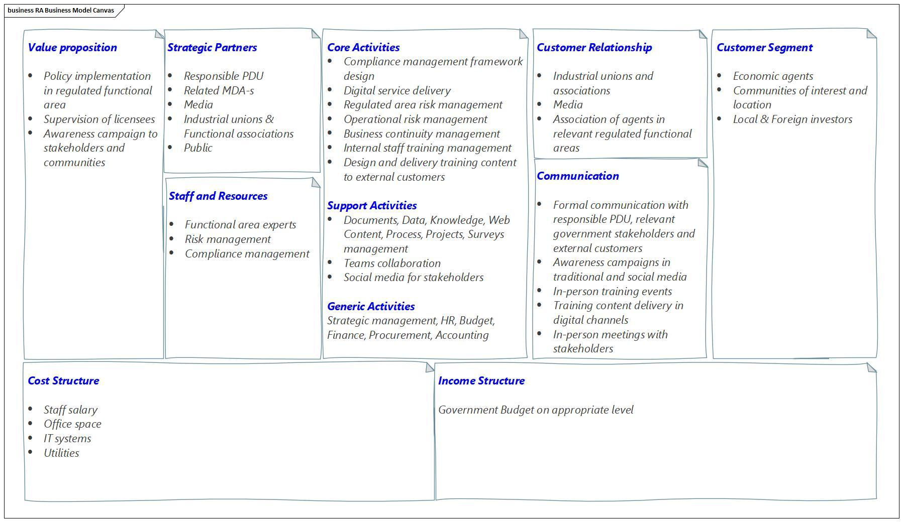

# 6. Annex 1 – Digital Infrastructure

## A1.1 Reference Model – National Level

In the reference model for the national level of digital governance ecosystem we present a list of main components, which should be presented in the target architecture.

### A1.1.1 Foundation

1\. Digital Forms of Law and Compliance Systems consist of provisions and norms that regulate digital transactions and promote the implementation and protection of human rights in the digital era within digital government systems. These rights encompass a wide range of digital freedoms and responsibilities, including:&#x20;

* The right to access the Internet, digital identification tools, digital asset storage, and other digital technologies; the protection of life and personal, biometric, and biological data.&#x20;
* The right to participate in the management of societal affairs, whether at the state level or potentially within future systems of global governance, through digital technological platforms.&#x20;
* Rights related to the ownership, use, and management of digital property and assets, as well as the conduct of digital economic activities such as transactions and digital deals, and access to systems of digital security.&#x20;
* Access to social services provided through digital technological platforms.&#x20;
* Rights to access cultural values and educational resources digitally. These facets underscore the broad scope of human rights in the digital era, highlighting their crucial role in contemporary and future societal structures.

2\. E-Governance Frameworks: Strategies and policies that guide the implementation and evolution of digital services.

### A1.1.2 Access Pillar

1\. High-Speed Connectivity: Reliable and fast internet access is the backbone of digital services, ensuring that all citizens can connect to government platforms.

2\. Accessibility Features: Ensuring that digital services are usable by all citizens, including those with disabilities.

3\. Cybersecurity Framework: Robust security protocols and infrastructure to protect sensitive data and ensure privacy and trust in digital transactions.

### A1.1.3 Data Pillar

1\. Data Centres and Cloud Services: Efficient and secure data storage and processing capabilities that allow for scalability and resilience of digital services.

2\. Monitoring and Analytics Tools: Systems to analyse service delivery and usage patterns, leading to informed decision-making and service improvements.

3\. Data protection institutional infrastructure.

### A1.1.4 Interoperability Pillar

Interoperable Platform: An ecosystem that facilitates data exchange and integrated services across different government departments. The following components should be part of the ecosystem.

1. API Management Tools: These tools are used to create, publish, and manage APIs, which are sets of protocols for building and interacting with software applications. They help in securing, scaling, and monitoring API traffic.
2. Identity and Access Management (IAM): This component ensures that the right organisations can access the right resources at the right times and for the right reasons.
3. Data Format and Transformation Services: These services convert data from one format to another so that different systems can understand and use the information without manual intervention
4. Registry/Repository Services: Central directories where metadata, services, and components are catalogued and can be queried or invoked. They help in service discovery and management.
5. Security Services: This includes encryption, digital signatures, secure data transmission protocols, and other cybersecurity measures to ensure data integrity and confidentiality.
6. Monitoring and Logging Services: These services track the health and usage of the interoperability platform, recording data on transactions, performance, and potential security incidents.
7. Business Rules Management: A system for defining, deploying, monitoring, and maintaining the complex decision logic used by system processes.
8. Workflow and Business Process Management (BPM): Tools that allow for the design, execution, and automation of business processes involving multiple interconnected systems.
9. Master Data Management (MDM): Software that ensures the uniformity, accuracy, stewardship, semantic consistency, and accountability of the enterprise's official shared master data assets.
10. Service Orchestration: The middleware that coordinates and combines services, resources, and data into complex business processes across the interoperability platform.

### A1.1.5 Identity Pillar

Digital Identity and Authentication: Secure and accessible means for citizens to verify their identities online to access various services.

A national identity ecosystem is a framework that enables the trusted establishment, use, and interoperability of digital identities. It should have following components.

1. Identity Management Systems (IdMS): These systems manage the lifecycle of digital identities, including creation, maintenance, and deletion, i.e., registration, de-registration, identity proofing, and credential management.
2. Authentication Services: These services verify users' identities when they log in or access services. They may support various mechanisms such as PKI-based authentication, biometrics, one-time passwords (OTPs), security tokens, and multi-factor authentication (MFA), etc.
3. Authorization Services: Once authentication is verified, these services determine what resources or services the user can access based on their identity, roles, and policies.
4. Credential Management: This involves the issuance, renewal, revocation, and management of digital credentials that assert identity attributes, such as digital certificates.
5. Public Key Infrastructure (PKI): PKI is a framework that creates, manages, distributes, uses, stores, and revokes digital certificates and manages public-key encryption, enabling secure electronic transfer of information.
6. Federated Identity Management: This enables users to access multiple applications and services with one set of credentials. It includes Identity Federation Hub, a centralised service connecting various identity providers and service providers to facilitate cross-domain authentication and authorisation.
7. Single Sign-On (SSO): A user authentication process that allows a user to access multiple applications with one set of login credentials.
8. Civil Registry Integration: Software components that integrate with civil registry databases to ensure that identity data is consistent with official government records. This also includes biometric systems integration, which uses physical characteristics (fingerprints, facial recognition, iris scans, etc.) to identify individuals uniquely.
9. User Self-Service Interfaces that allow users to manage their profiles, reset passwords, and update personal information.
10. Audit and Compliance Reporting Tools: Systems to monitor and report on identity-related activities, ensuring compliance with legal and regulatory requirements.
11. Privacy Management Tools: Software to manage and enforce policies related to the privacy of personal identity information.
12. Consent Management Platforms: Systems that manage user consent for data sharing and processing, which are vital for complying with privacy laws and regulations.

### A1.2 Reference Model – Organisational Level

#### A1.2.1 Taxonomy Overview

The COFOG Governmental Functions classification identifies 10 government functions, which are further divided into 69 functions. These can be carried out by hundreds or even thousands of public administration organizations at the federal, state, and local municipality levels. Each organization may have multiple performance outcome areas requiring digital transformation.

However, upon detailed analysis, it was found that the differences in those areas primarily lie in the data, whereas the required automation components are not that dissimilar.

#### **Public Sector Organisational Taxonomy**

Currently, we see that public sector intervention into the economy and society can be viewed as following main types of organisational architectures:

<table data-header-hidden><thead><tr><th width="107"></th><th></th><th></th></tr></thead><tbody><tr><td>ID</td><td>Type</td><td>Touchpoints with customers</td></tr><tr><td>1.</td><td>Policy development unit is making analysis, develop policies and monitor policies efficiency. Typical example of such a unit is a line ministry.</td><td><ul><li>Informal communication with stakeholders in society</li><li>Formal communication to prepare legislation.</li></ul>
 
</td></tr><tr><td>2. </td><td>Regulatory agency is responsible for specific area in society, which requires regulations and policies enforcement. For example, data protection authority, business registration, licensing etc.</td><td><ul><li>Formal communication with applicants and decision-making process regarding licenses &#x26; permissions</li><li>For one individual or company there are not many interactions: issuing license/permission, suspension and/or ending of license/permission.</li><li>Informal conflict resolution</li></ul>
 
</td></tr><tr><td>3.</td><td>Service delivery authority, which is not only involved in regulatory activities but also applies specialised methods to ensure enforcement of legal regulations. Examples: Police Department, Tax Department, Customs, Treasury, etc.</td><td><ul><li>Formal onboarding of customers</li><li>Most of the time recurrent service delivery</li><li>Solid training process to build awareness amongst external customers and skills for employees</li></ul></td></tr></tbody></table>

#### **Ecosystem**

In addition to the above three main types of public sector organisation there are several important elements in the public administration ecosystem:

* State registries. A state register is an official record-keeping system maintained by a government entity in which vital information is stored and managed. This can include records on individuals, such as births, marriages, and deaths; legal documents like property deeds and business licenses; or more specific registers like those for motor vehicles or professional credentials. State registers serve as a reliable source of legal documentation and are used to ensure public administration processes are accurate and effective.
* Government internal organisations, which are providing support services to other government organisations. We call systems in such organisations as Horizontal Systems.&#x20;

PAERA facilitates an outward-looking approach to the public sector digital transformation, which puts the citizen’s ability to utilise digital services is in the centre of our attention. Hereunder PAERA introduces the concept of Natural Digital Environment and Sectoral Ecosystems.

The following describes the architectural building blocks that make up those architectures.

### A1.2.2 - 1st type: Policy Development Unit

#### **Business Model**

The Policy Development Unit (PDU) is the most basic bureaucratic organisational unit. The digital platform in this unit should support all main bureaucratic organisational activities. Digital support for such a basic unit should have at least two areas.&#x20;

1. Direct support for specific function policy development and
2. Generic organisation management service (for example, HR, finance, etc.)

Examples: ministries, chancelleries of constitutional institutions (like the President, Prime Minister, etc.).

For the PDU type of organisation, a generalised business model can be described in the following way:

<figure><figcaption>
Figure 11 - PDU Business Model Canvas
</figcaption></figure>

The following are details for the business model for PDU:

<table data-header-hidden><thead><tr><th width="175"></th><th width="260"></th><th></th></tr></thead><tbody><tr><td>Pillar</td><td>Component</td><td>Description</td></tr><tr><td>Product</td><td>Value proposition</td><td>
1. Policy Development
<ul><li>Responsible for specific functional area, i.e., defence, health, social care etc.</li><li>Develop and maintain legislation to regulate the area of responsibility.</li><li>Communicate with stakeholders explaining policies and identifying issues and needs.</li></ul>
 

2. Supervision of policy implementation
<ul><li>Set up KPI-s and needed reporting.</li><li>Staffing of managers</li></ul>
 

3. Research

  
</td></tr><tr><td>Customer interface</td><td>Customer Segment</td><td><ul><li>Population demographic groups</li><li>Economic agents</li><li>Non-profit organisations</li><li>Communities of interests and locations</li><li>Foreign investors</li><li>International organisations</li></ul>
 
</td></tr><tr><td></td><td>

 Communication
</td><td>

<ul><li>n-person meetings with stakeholders</li></ul><ul><li>Media analysis</li></ul><ul><li>Insource of research from external professionals</li></ul><ul><li>Formal communication within the legislation development process with internal government stakeholders, i.e., other ministries, government, parliament etc.</li></ul><ul><li>Social media</li></ul></td></tr><tr><td></td><td>
Customer Relationships

 
</td><td>

<ul><li>Setup permanent relationships with industrial unions and NGO-s in the relevant functional area for economy or society</li></ul><ul><li>Setup close relations with media to be capable to build awareness campaigns for relevant society groups and economy agents.</li></ul></td></tr><tr><td>Infrastructure Management</td><td>Value Configuration</td><td>
Group 1. Specific public administration capabilities:
<ul><li>Policy development</li><li>Legislation development</li><li>Policy implementation monitoring</li><li>Processing of requests from stakeholders</li><li>Making decisions and delivering answers</li><li>Managed entities supervision</li><li>Coordination with EU and international stakeholders</li><li>Research</li></ul>
 

Group 2. Policy development support activities:
<ul><li>Documents management</li><li>Data gathering, data management and analytics.</li><li>Knowledge Management</li><li>Web Content Management</li><li>Process Management</li><li>Project Management </li><li>Teams Collaboration</li><li>Surveys Management</li><li>Engagement with stakeholders through social media</li></ul>
 

Group 3. Generic organisation support capabilities:
<ul><li>HR management, including structure management, job descriptions, hiring, etc.</li><li>Risk management</li><li>Budget, Finance, Procurement &#x26; Accounting</li><li>Strategic Management</li></ul>
 
</td></tr><tr><td></td><td>

 Staff and Resources
</td><td>

<ul><li>Functional area expertise</li></ul><ul><li>Legal experts</li></ul><ul><li>Institutional building expertise</li></ul></td></tr><tr><td></td><td>
Strategic Partners

 
</td><td>

<ul><li>Parliament</li></ul><ul><li>Government</li></ul><ul><li>Ministries</li></ul><ul><li>Media</li></ul><ul><li>Industrial unions</li></ul><ul><li>Public</li></ul></td></tr><tr><td>Financial Aspects</td><td>Cost Structure</td><td>
Main cost components:
<ul><li>Staff salary</li><li>Office space</li><li>IT systems</li><li>Utilities</li></ul>
 
</td></tr><tr><td></td><td>
Income Structure

 
</td><td>Appropriate governmental-level Budget</td></tr></tbody></table>

#### **PDU Application Architecture Outline**

The following application architecture is needed to digitalise PDU activities:

<figure><figcaption>
Figure 12 - Reference Application Architecture for PDU Activities
</figcaption></figure>

Here, we have three main areas of application architecture:

* **Channels** zone – implements secure omni-channel access capabilities for all external customers and stakeholders. This should be well standardised and use standard national digital infrastructure building blocks for security services like authentication, authorisation, digital signature, etc.
* **Infrastructure** – standard component to enable modern data-driven processing, including data collection from many different sources, data consolidation into analytical data sets, visualisation, etc. This zone should be fully standardised and ideally part of a governmental cloud.
* Public Administration **Core Services** automation support zone – implements application software components to support the activities of the PDU staff. Following is a description of those components for the core services support..

The Policy Development Unit (a ministry) is primarily responsible for formulating, analysing, and implementing policies in different functional areas. Such a unit requires a suite of software components that facilitate research, collaboration, data analysis, and stakeholder engagement.

1. Document Management Systems (DMS): These systems are crucial for creating, storing, managing, and tracking documents and revisions. A DMS helps maintain an organized repository of policy drafts, official documents, legal texts, and related materials, ensuring that the latest versions are always accessible.
2. Collaboration and Communication Tools: Software that enables effective communication and collaboration among team members, stakeholders, and other departments is essential. This includes email, instant messaging apps, video conferencing tools, and platforms that support collaborative document editing and sharing.
3. Data Analysis and Visualization Tools: Policy development relies heavily on data to inform decisions. Tools that can analyse large datasets, perform statistical analysis, and visualise data trends are critical. These tools help understand complex information, identify patterns, and present data in an easily digestible format for decision-makers.
4. Project Management Software: This software helps plan, execute, and monitor policy development projects. It can track progress, manage tasks, allocate resources, and keep timelines, ensuring policy initiatives progress as planned.
5. Stakeholder Engagement Platforms: Engaging with stakeholders is a key part of policy development. Platforms facilitating surveys, feedback collection, public consultations, and forums can help gather insights, concerns, and suggestions from the public, industry experts, and other relevant parties.
6. Content Management Systems (CMS): For policy units that publish reports, guidelines, or any public-facing documents, a CMS is vital. It allows for the easy creation, management, and publication of content on websites or intranets, ensuring that information is accessible to relevant audiences.
7. Legislative Tracking Software: This software helps monitor legislation and regulatory changes that could impact policy areas. It can track bills, regulations, and other legislative documents across various stages, providing alerts and updates relevant to the unit’s focus areas. Also, it integrates the PDU with national legislation drafting activities.
8. Research and Reference Management Software: Tools that assist in organising research materials, references, and bibliographies are essential for policy development. They facilitate the management of digital libraries, streamline the citation process, and support literature reviews.
9. Case Management: A case management system can be adapted to manage relationships and interactions with stakeholders, experts, and other external parties involved in policy consultation and feedback processes. Also, it provides visibility over performance and service delivery quality, providing capabilities to manage SLAs and KPIs.
10. Secure File Sharing and Storage Solutions: Given the sensitive nature of policy work, secure platforms for storing and sharing documents are necessary. These solutions protect sensitive information through encryption, access controls, and audit trails.&#x20;
11. Risk Management and Compliance Software: This software helps identify, assess, and mitigate risks associated with policy proposals. It also ensures policies comply with existing laws and regulations, minimising legal and operational risks.
12. HR, Budget, and Accounting: all public administration organisations have standard corporate services implementation for budgeting operations and accounting of personnel, salary and resources.

By integrating these software components, a Policy Development Unit can enhance its efficiency, effectiveness, and responsiveness in policymaking.

These tools support the complex tasks of analysing data, managing projects, engaging with stakeholders, and ultimately developing policies that are well-informed, timely, and relevant.

**NOTE**: This set of components is required in all types of public administration organisation. We will refer to this set of building blocks as **Public Administration Organisation Core** **Components** (PAO-CC).

### A1.2.3 - 2nd type: Regulatory Agency

#### **Business Model**

The Regulatory Agency (RA) is responsible for the implementation of regulatory policies in some functional areas. They are accountable to PDU, which is in charge for the policy development in their functional area.

For the RA type of organisation, a generalised business model can be described in the following way:

<figure><figcaption>
Figure 13 - RA business model canvas
</figcaption></figure>

Examples: Financial Service Authority, Commercial Register, Trade Licenses, Data Protection Authority, etc.

The following are details for the business model for RA:

\

<table data-header-hidden><thead><tr><th width="138"></th><th width="280"></th><th></th></tr></thead><tbody><tr><td>Pillar</td><td>Component</td><td>Description</td></tr><tr><td>Product</td><td>Value proposition</td><td>
1. Policy Implementation regarding specific regulated governance functional area
<ul><li>Detailed requirements formulation.</li><li>Design of application forms and procedures for application of license/permission.</li><li>Review and assessment of an application for license/permission.</li><li>Fee collection.</li><li>Issuing of licenses/permissions.</li><li>Register of license/permission management.</li></ul>
 

2. Supervision of licensees
<ul><li>Set up required regular reporting framework.</li><li>Collection of regular reports</li><li>Risk management</li><li>Intervention in case of high risk</li><li>Resolution of issues with non-compliant licensees</li></ul>
 

3. Awareness campaigns to stakeholders and communities

 
</td></tr><tr><td>Customer interface</td><td>Customer Segment</td><td><ul><li>Economic agents</li><li>Communities of interests and locations</li><li>Local &#x26; Foreign investors</li></ul>
 
</td></tr><tr><td></td><td>Communication</td><td>

<ul><li>Formal communication with Policy Development body to whom RA is accountable.</li></ul><ul><li>Formal communication with other relevant government stakeholders, i.e., other MDA-s, government, parliament etc.</li></ul><ul><li>Formal and informal communication with applicants and licensed agents</li></ul><ul><li>Awareness campaigns in traditional and social media</li></ul><ul><li>In-person training events</li></ul><ul><li>Training content delivery in digital channels</li></ul><ul><li>In-person meetings with stakeholders</li></ul></td></tr><tr><td></td><td>
Customer Relationships

 
</td><td><ul><li>Setup permanent relationships with industrial unions in the relevant functional area of economy or society</li></ul><ul><li>Setup close relations with media to be capable to build awareness campaigns for relevant society groups and economy agents.</li></ul></td></tr><tr><td>Infrastructure Management</td><td>Value Configuration</td><td>
RA must have all Group 2 and 3 capabilities, which are listed for PDU in the section 4.2.1. 

 

Group 4. In additional to that, there should be following specific public administration capabilities:
<ul><li>Compliance management framework design</li><li>Digital service delivery</li><li>Regulated area risk management</li><li>Operational risk management</li><li>Business continuity management</li><li>Internal staff training regarding service delivery.</li><li>Design and delivery of training content to licensees and potential applicants.</li><li>Reporting to appropriate PDU</li></ul>
 
</td></tr><tr><td></td><td>
Staff and Resources

 
</td><td>

<ul><li>Functional area expertise</li></ul><ul><li>Risk management</li></ul><ul><li>Compliance management</li></ul></td></tr><tr><td></td><td>
Strategic Partners

 
</td><td>

<ul><li>Responsible PDU</li></ul><ul><li>Related (horizontally) MDA-s</li></ul><ul><li>Media</li></ul><ul><li>Industrial unions</li></ul><ul><li>Public</li></ul></td></tr><tr><td>Financial Aspects</td><td>Cost Structure</td><td>
Main cost components:
<ul><li>Staff salary</li><li>Office space</li><li>IT systems management</li><li>Utilities</li></ul>
 
</td></tr><tr><td></td><td>
Income Structure

 
</td><td>Appropriate level government Budget</td></tr></tbody></table>

#### RA Application Architecture Outline

The following application architecture is needed to digitalise regulatory agency (RA) activities:

<figure><figcaption>
Figure 14 - RA application architecture reference model
</figcaption></figure>

It includes all components from the PDU model, i.e. Channel zone, Infrastructure zone and Public Administration Core Components (PAO-CC). In addition, there are BBs for digital service delivery.

**1. Forms & Procedures Design**

Implementing forms and procedures design in a public administration regulatory agency requires software that supports creating, managing, and optimising digital forms and workflows.&#x20;

The software should enable the organisation to design user-friendly forms, automate processes, and manage data efficiently:

* Intuitive Form Builder: A drag-and-drop interface that allows non-technical users to create and design forms quickly. This should include the ability to add various field types (e.g., text, dropdowns, checkboxes), validation rules, and conditional logic to show or hide fields based on user inputs.
* Workflow Design: Tools to define and automate business processes and workflows associated with forms.
* Integration Capabilities: Integrating with other systems and databases is crucial for automating data entry and retrieval, ensuring that form data can flow seamlessly between systems. This includes PAO-CC, such as Case Management, ERP, document management systems, and payment gateway.
* Data Validation and Verification: Features to validate form inputs in real-time to ensure data accuracy and completeness. This might include checking for valid email addresses and required fields and integrating with external databases for verification.
* Customisable Templates: A library of pre-built form templates that can be customized to suit different services and processes.
* Mobile Responsiveness: Forms should be accessible and easy to complete on any device, including smartphones and tablets.
* Multilingual Support: Features to create and manage forms in multiple languages, catering to a diverse population and ensuring inclusivity in service delivery.
* Feedback Mechanisms: Incorporating feedback forms or surveys to collect user feedback on the form-filling experience and the efficiency of the service delivery process.
* Version Control: Keeping track of changes made to forms and procedures over time, allowing for the rollback to previous versions if needed.

**2. Application Capturing & Processing**

Implementing application forms capturing and processing workflows in a regulatory agency involves managing the entire lifecycle of applications, from submission to final decision.&#x20;

The software supporting these workflows must facilitate efficient, accurate, and user-friendly processes both for the applicants and the administrative staff:

* Automated Workflow Management: The ability to define, automate, and manage workflows associated with the application process, i.e., routing applications for review and approval, assigning tasks to specific staff members, setting deadlines, and automating notifications and reminders.
* Electronic Signatures and Document Uploads: Features that allow applicants to sign documents and securely upload necessary supporting documents electronically.
* Role-Based Access Control: The ability to define access levels for different users, ensuring that staff and applicants can only access information and functionalities relevant to their role in the application process.
* Reporting and Analytics: Tools to track and analyse application data, monitor workflow efficiency, and generate reports, including support for identification bottlenecks, tracking processing times, and improving service delivery.
* Communication Tools: Integrated communication tools for sending automated emails or messages to applicants regarding the status of their application, requests for additional information, and final decisions.
* Scalability: The software should be scalable to handle varying volumes of applications and adaptable to process changes or the introduction of new services.

**3. Payment & Refund processing**

Implementing payment and refund processing workflows involves handling financial transactions securely and complying with regulations.&#x20;

The software supporting these workflows must facilitate efficient and accurate processing, provide a good user experience, and ensure the highest levels of security and compliance:

* Secure Payment Gateway Integration: Integration with secure and reliable payment gateways to process various forms of payment, including credit/debit cards, bank transfers, mobile money and digital wallets. The software should support multiple payment methods to accommodate the preferences of all users.
* PCI DSS Compliance: Adherence to the Payment Card Industry Data Security Standard (PCI DSS) and other relevant security standards to protect cardholder data during transactions.
* Flexible Refund Processing: The ability to process refunds efficiently, allowing for full or partial refunds directly through the platform. This should include automated workflows for approving and processing refund requests.
* Real-Time Transaction Processing: Capability to process payments and refunds in real-time, providing immediate feedback to users about the status of their transactions.
* Fraud Detection and Prevention: Security features to detect and prevent fraudulent transactions, including encryption, secure authentication, risk-based analysis, and monitoring of suspicious activities.
* Multi-Currency Support: The ability to process payments in multiple currencies is essential for organisations serving an international audience (e.g., foreign investors).
* Financial Reporting and Analytics: Tools for generating detailed financial reports and analytics, providing insights into payment volumes, refund rates, revenue, and other key financial metrics.
* Automated Receipt Generation: Automatic generation and sending of receipts for payments and refunds to users via email or available for download, providing proof of transactions.
* Audit Trails: Comprehensive logging of all transactions, including payments and refunds, to create an audit trail for compliance, dispute resolution, and financial auditing purposes.
* Integration with Financial System: Seamless integration with the organisation's financial system to automate the reconciliation process and ensure accurate financial records.
* Customer Support Tools: Integration with customer support tools to assist users with payment-related inquiries and issues, including refunds, transaction disputes, and technical problems.

**4. Decision Management**

Implementing Decision Management workflows in a public administration regulatory authority requires support for making, recording, and communicating decisions related to regulations, compliance, and enforcement actions.&#x20;

This requires software that supports complex decision-making processes and ensures transparency. POA-CC components support such functionality. It only requires the configuration of specific workflows and document templates.&#x20;

The following specific aspects, however, should be added:

* Notification and Communication Systems: Automated notifications and communication features to inform relevant parties about decisions, updates, or required actions. This could include email alerts, SMS notifications, or in-platform messages.
* Regulatory Compliance Management: Tools to ensure all decisions comply with applicable laws, regulations, and standards. This may include checklists, compliance tracking, and integration with legal databases.
* Integration with Public Access Portal: A portal for stakeholders and the public to access information on decisions, regulations, and compliance requirements.
* Customisable Dashboards: These provide an overview of decision-making activities, status updates, and key performance indicators (KPIs).
* 14\. Decision Modelling and Analytics: Tools for modelling decision processes and analysing decision outcomes. This can help identify patterns, predict impacts, and optimise decision-making strategies.

**5. Inspections Management**

Implementing inspection management workflows in a regulatory authority involves coordinating and tracking a wide range of activities, from scheduling inspections to recording outcomes and enforcing compliance.

POA-CC components support such functionality. It only requires the configuration of specific workflows and document templates.&#x20;

The following specific aspects, however, should be added:

* Scheduling and Calendar Integration: Tools for scheduling inspections, including calendar integration that allows for easy assignment of inspectors and visibility into their schedules.&#x20;
* Mobile Access and Offline Capability: Mobile applications or web access enable inspectors to access and input data in the field, even without an internet connection. Once a connection is re-established, the data should sync with the central system.
* Checklist and Form Customization: The ability to create, customise, and update inspection checklists and forms. This should include support for various types of data entry, such as text, checkboxes, dropdown lists, and photo uploads.
* Geolocation Services: Geolocation services are integrated to help plan routes, verify inspection locations, and log the location of an inspection for accountability and efficiency.
* Compliance Tracking and Enforcement: Tools to track compliance status, record violations, and manage enforcement actions such as fines, warnings, or follow-up inspections.
* Communication Tools: Integrated communication tools to facilitate direct communication between inspectors, regulated entities, and other stakeholders.&#x20;

**6. Legal Affairs & Litigation**

Implementing Legal Affairs & Litigation workflows in a public administration regulatory authority involves managing various legal documents, cases, and processes efficiently and effectively.&#x20;

The software supporting these workflows must be capable of handling complex legal operations, ensuring compliance, and facilitating collaboration among legal teams, other departments, and external parties.

Mostly POA-CC components support such functionality. It requires the configuration of specific workflows and document templates. The following specific aspects, however, should be added:

* Calendar and Deadline Tracking: Integration with calendars to track important dates, deadlines, hearings, and meetings. Automated reminders can help ensure that no critical dates are missed.
* Legal Research Tools: Access to legal databases and research tools within the platform to support legal analysis, precedent research, and case preparation.
* Security and Compliance: High-level security features to protect sensitive legal information, including encryption, access controls, and compliance with relevant legal and regulatory standards.
* Litigation Support: Features that support litigation activities, including evidence management, discovery process management, and integration with court filing systems.
* Financial Management: Integration with financial systems for managing legal budgets, expenses, invoicing, and cost recovery.
* Knowledge Management: A centralized repository for storing and sharing legal knowledge, such as memos, legal opinions, and guidelines, to support decision-making and ensure consistency.
* E-Discovery and Evidence Management: Tools for managing the collection, processing, review, and production of electronic documents as part of the discovery process.
* Complaint and Dispute Resolution Management: Mechanisms to track and manage complaints, disputes, and non-litigation cases, including mediation and arbitration processes.

### A1.2.4 - 3rd type: Service Delivery Authority

#### Business Model

The Service Delivery Authority (SDA) is the most complex governmental organizational unit. The digital platform in this unit should support not only internal processes automation, but also intensive communication with external customers. Examples: Customs, Tax Authority, Police Department, etc.

Digital support for such a unit may have many areas, including the following:&#x20;

1. Support for strategic management and planning
2. Support for customer experience management and service delivery framework design
3. Core value chain automation systems, including G2B, G2C, and G2G integration with external customers.
4. Support for extensive data management
5. Generic organization management service (for example, HR, finance, etc.)

For the SDA type of organization, a generalized business model can be described in the following way:

<figure><figcaption>
Figure 15 - SDA business model canvas
</figcaption></figure>

The following are details for the business model for RA:

<table data-header-hidden><thead><tr><th width="95"></th><th></th><th></th></tr></thead><tbody><tr><td>Pillar</td><td>Component</td><td>Description</td></tr><tr><td>Product</td><td>Value proposition</td><td>
1. Policy Implementation regarding specific regulated governance functional area
<ul><li>Detailed compliance requirements formulation.</li><li>Design of forms and procedures for policy requirements implementation in the regulated functional area.</li><li>Enforcement of requirements for agents in the regulated area.</li></ul>
2. Supervision and enforcement of compliance in regulated area
<ul><li>Regular data gathering</li><li>Risk management</li><li>Intervention in case of high risk</li><li>Resolution of issues with non-compliant licensees</li></ul>
 

3. Awareness campaigns to external customers, stakeholders, and communities.

 

4. Gathering feedback from customers and stakeholders and adjusting the service delivery framework accordingly.

 
</td></tr><tr><td>Customer interface</td><td>Customer Segment</td><td><ul><li>Economic agents</li><li>Communities of interests and locations</li><li>Local &#x26; Foreign investors</li></ul>
 
</td></tr><tr><td></td><td>

 Communication
</td><td>

<ul><li>Formal communication with Policy Development body to whom SDA is accountable.</li></ul><ul><li>Formal communication with other relevant government stakeholders, i.e., other MDA-s, government, parliament etc.</li></ul><ul><li>Formal and informal communication with agents in regulated area</li></ul><ul><li>Awareness campaigns in traditional and social media</li></ul><ul><li>In-person training events</li></ul><ul><li>Training content delivery in digital channels</li></ul><ul><li>In-person meetings with stakeholders</li></ul></td></tr><tr><td></td><td>

Customer Relationships 
</td><td>

<ul><li>Setup permanent relationships with industrial unions in the relevant functional area of economy or society</li></ul><ul><li>Setup close relations with media to be capable to build awareness campaigns for relevant society groups and economy agents.</li></ul></td></tr><tr><td>Infrastructure Management</td><td>Value Configuration</td><td>
SDA must have all Group 2 and 3 capabilities, which are listed for PDU in the section 4.2.1. 

 

Also, SDA must have Group 4 capabilities, which are listed for RA in the section 4.3.1. 

 

Group 5. In additional to that, there should be following specific public administration capabilities:
<ul><li>Performance management (for internal staff)</li><li>Service Management (SLA-based quality assurance for external customers)</li><li>Enterprise Architecture management </li><li>IT Planning and strategic management</li><li>IT Security management</li></ul>
  
</td></tr><tr><td></td><td>

Staff and Resources 
</td><td>

<ul><li>Functional area expertise</li></ul><ul><li>Compliance management</li></ul><ul><li>Risk management</li></ul><ul><li>Business continuity management</li></ul><ul><li>Digital service delivery</li></ul></td></tr><tr><td></td><td>

 Strategic Partners
</td><td>

<ul><li>Responsible PDU</li></ul><ul><li>Related (horizontally) MDA-s</li></ul><ul><li>Media</li></ul><ul><li>Industrial unions</li></ul><ul><li>IT provider</li></ul><ul><li>Customers’ IT development community</li></ul><ul><li>Public</li></ul></td></tr><tr><td>Financial Aspects</td><td>Cost Structure</td><td>
Main cost components:
<ul><li>Staff salary</li><li>Office space</li><li>IT systems management, including Digital Service management, EA management and Operational risk and business Continuity management.</li><li>Utilities</li></ul>
 
</td></tr><tr><td></td><td>
Income Structure

 
</td><td>Appropriate level of Government Budget</td></tr></tbody></table>

### SDA Application Architecture Outline

The following application architecture is needed to digitalise SDA activities:

<figure><figcaption>
Figure 16 - SDA application architecture reference model
</figcaption></figure>

It includes all the Regulatory Agency model components, i.e., Channel zone, Infrastructure zone, Public Administration Core Components (PAO-CC) and Regulatory Supervision & Compliance Monitoring components. In addition, there are BBs for digital service delivery for a massive number of transactions:

1. Registration & Profile Management
2. Customers & Users Management
3. Online Learning & Training
4. Customer Accounting
5. Compliance & Enforcement
6. Data Management

To a certain level, this functionality is also presented in the regulatory agency (RA) model. However, those components must be scaled up to the next level for service delivery in the context of massive transactions. For example, those functional components for RA can be implemented using low-code/no-code platforms. For SDA, this implementation requires custom development. to ensure performance and availability during workload peaks for millions of concurrent transactions.

**1. Registration & Profile Management**

Implementing Registration & Profile Management in a service delivery organisation involves managing business and/or citizen information securely and efficiently while ensuring easy access and interaction for users.&#x20;

The software supporting these functions must be robust, user-friendly, and secure, facilitating the management of personal and financial information.

* Customer Registration, Authentication and Authorisation: A secure and straightforward process for users to register and associate with profiles of legal entities on behalf of which they are acting. This should include very strong security authentication to ensure legally binding transactions, non-repudiation, and personalisation of service delivery.
* Privacy Controls and Consent Management: Tools for users to control their privacy settings and manage consents for how their information is used and shared, in compliance with data protection regulations.
* Communication Preferences Management: The ability for users to set and manage their communication preferences, including the types of notifications they wish to receive and through what channels (email, SMS, etc.).
* Personalised Dashboard: A personalised dashboard that gives customers an overview of their profile status, pending actions, recent transactions, and other relevant information.
* Multilingual Support: Support for multiple languages to accommodate the diverse population the organisation serves.

**2. Customers & Users Managemen**

Implementing Customer & Users Management in a public administration service delivery organisation requires a comprehensive set of software features to effectively manage the information and interactions of individuals and businesses.&#x20;

* Centralised User Database: A robust database to store and manage comprehensive profiles of customers, including personal information, contact details, transaction history, and compliance status.
* Secure Registration and Authentication: A secure process for new and existing users to act on behalf of legal entities.
* Account Recovery and Support: Robust mechanisms for account recovery in case of lost passwords or compromised accounts, including customer support features for assisting users with account management issues.
* Role-Based Access Control (RBAC): The ability to define roles and permissions for different types of users (e.g., individuals, business representatives, tax advisors) to control access to sensitive information and functionalities based on their role.
* Audit Trails and Activity Logs: Comprehensive logging of all user activities within their profile for security and compliance purposes, ensuring that any unauthorised access or changes can be traced and investigated.
* Customer Support and Ticketing System: A built-in support system to manage user inquiries and issues, including a ticketing system for efficiently tracking and resolving support requests.
* Analytics and User Behaviour Tracking: Tools to analyse user behaviour, service usage patterns, and satisfaction levels to inform service improvements and policy decisions.
* Bulk Operations and Communications: Features to manage bulk operations, such as mass updates or communications, to handle large user bases efficiently.
* Accessibility Features: Ensuring that the system is accessible to all users, including those with disabilities, following web accessibility standards.

**3. Online Learning & Training**

Implementing Online Learning & Training within a service delivery organisation requires comprehensive software features to create a compelling, engaging, and accessible learning environment. Support should be provided for the delivery of training materials, facilitate interactive learning, and enable tracking and assessment of learner progress.

To a limited extent, POA-CC components support some of the required functionalities. It requires the configuration of specific workflows and templates, and the following specific aspects should be added:

* Course Catalogue and Enrolment: An online catalogue of available courses with detailed descriptions, prerequisites, and enrolment options. Users should be able to easily browse, search, and enrol in courses.
* Learning Pathways: The ability to create structured learning pathways or curriculums that guide learners through courses or modules based on their roles, learning goals, or skill levels.
* Interactive Learning Tools: Features such as quizzes, interactive simulations, discussion forums, and live webinars to engage learners actively and support various learning styles.
* Assessment and Testing: Tools to create and administer tests and quizzes, including multiple-choice questions, essays, and practical tasks, with automatic grading where applicable.
* Certification and Badging: The ability to issue certificates or digital badges upon course completion or mastery of specific skills, providing recognition of learners’ achievements.
* Progress Tracking and Reporting: Dashboards and reporting tools for learners and administrators to track progress, completion rates, assessment scores, and other metrics to monitor learning outcomes.
* Instructor Tools and Resources: Tools for instructors to create and manage content, interact with learners, provide feedback, and monitor class or course progress.
* Feedback and Evaluation: Mechanisms for collecting feedback from learners about courses, instructors, and the overall learning experience to inform continuous improvement.

**4. Customer Accounting**

Implementing Customer Accounting in a service delivery organisation requires a robust set of software features that can handle complex transactions, ensure compliance with laws, and provide a user-friendly interface for customers and administrators.

* Reports Filing and Processing: Features to support the submission of regular reports (for example, tax returns in a revenue authority or financial reporting in a business registry or statistical department) with pre-validation of data to reduce errors.
* Payment Processing Integration: Integration with payment gateways to facilitate payments and refunds, supporting various payment methods (credit/debit cards, bank transfers, digital wallets) and providing real-time transaction processing.
* Account Management: Tools for customers to manage their accounts, including viewing account transactions.
* Automated Calculations: Automated calculation features to pre-fill forms for customers.
* Customer Support and Inquiry Management: Integrated customer support features, including a ticketing system for managing customer inquiries and issues, FAQs, and live chat support.
* Integration with Other Government Systems: Capabilities to integrate with other government databases and systems for data verification and compliance checks and to provide a holistic view of customer obligations and entitlements.

**5. Compliance & Enforcement**

Implementing Compliance & Enforcement in a service delivery organisation requires components to support activities to monitor, detect, and act upon compliance issues efficiently.

To some extent, POA-CC components support the required functionalities. It involves the configuration of specific workflows and templates, and the following particular aspects should be added:

* Regulatory Database: A centralised database that contains all relevant laws, regulations, and compliance requirements, which can be easily updated as new legislation is passed or existing laws are amended.
* Automated Compliance Monitoring: Tools automatically monitor transactions, filings, and other regulated activities for potential compliance violations, using predefined rules and algorithms to identify anomalies and red flags.
* Advanced Specialised Risk Assessment Tools: Features that enable the assessment of compliance risks associated with specific entities, sectors, or activities, allowing for targeted enforcement and monitoring efforts based on risk profiles.
* Audit and Inspection Workflows: Workflow automation for planning, scheduling, and conducting audits and inspections, including checklists, reporting templates, and tools for auditors and inspectors to record findings and recommendations.
* Financial Analysis Tools: Advanced tools for analysing financial transactions, patterns, and records to detect signs of non-compliance, fraud, or other illicit activities.
* Penalty and Sanction Processing: Features for calculating, issuing, and tracking penalties and sanctions for compliance violations, including payment processing and appeals management.
* Stakeholder Communication: A secure channel for communicating with regulated entities, legal representatives, and other stakeholders, providing access to case information, document submission, and status updates.
* Whistle-blower and Complaint Submission: Secure and anonymous channels for whistle-blowers and the public to report suspected violations, including tips, complaints, and submission of supporting evidence, which could also serve as an automated evaluation and feedback mechanism.

**6. Data Management**

The Data Management component should contain at least the following building blocks:

* Data Format and Transformation Services: These services convert data from one format to another so that different systems can understand and use the information without manual intervention.
* Monitoring and Logging Services: These services track the health and usage of the service delivery platform, recording data on transactions, performance, and potential security incidents.
* Business Rules Management: A system for defining, deploying, monitoring, and maintaining the complex decision logic system processes use.
* Workflow and Business Process Management are tools that allow for the design, execution, and automation of business processes involving multiple interconnected systems.
* Master Data Management (MDM) is software that ensures the uniformity, accuracy, stewardship, semantic consistency, and accountability of the enterprise's official shared master data assets.
* Data Warehousing and Analytics: Systems that collect, store, and allow for analysing large volumes of data to inform decision-making and service improvements.
* Risk and Fraud Detection Systems: Analytical tools to identify suspicious activities and potential fraud

### A1.2.5 State Registries

One additional type of system is a state registry. For example, a business registry registers companies. In many countries, there are population registries to record the birth and death of individuals, along with all other important personal lifecycle events. The digitalization of such agencies requires two building blocks:

* Registration BB
* Digital Registry BB

Registration BB: Registration is a process through which an applicant gets information recorded in a registry and receives a credential as proof of registration, in exchange for providing information, with or without money. The information provided by the applicant consists of data and/or credentials issued by public or private entities. Money is provided to pay for one or more registration fees/costs. A registration involves at least two parties:

* applicant who wants to register (something or somebody);
* authorized representative of a registry in charge of registering the data and issuing the credential.

One registration may involve more than two parties, as one or more third parties can be requested to assert/confirm the information provided by the applicant (a notary, a family member, a witness, another public entity, or a non-human entity such as a database); or a third party can be requested to receive the payment made by the applicant (a bank, a cashier, an online payment service).&#x20;

The registry or registries where the information is written can also be considered as a third party.

Digital Registry BB: The Digital Registries Building Block provides services to other Building Blocks and to external systems, to store and manage data/claims on any entity (persons, places, and things) in forms of uniquely identifiable records in a database.

For example, these records could contain health and medical information, ownership of property, vehicles, money, qualifications, birth/expiry of people and entities, land surveys, manufacturing information of vehicles and equipment, banking, and commercial transactions, etc. Given the diversity of such information, this Building Block provides services useful to abstract the structure, linkages, and grouping of information into various records and collections such as financial, legal, medical, social, educational, commercial, etc., as needed.

The Digital Registry BB provides the capability to capture, store, search, distribute, and present data with zero or minimal need for software development. It also maintains and reports logs of all operations on database schemas and data. It contains various functional components and data resources to abstract away all the details and complexity and to expose capabilities as service-APIs to external Building Blocks/applications.

#### A1.2.6 Government Horizontal Systems

One additional type of system is an internal governmental system, where the provider and consumer are both public administration organisations (so-called G2G type). A non-exhaustive list of such G2G systems:

1. Procurement
2. HR management
3. Budget
4. Contracts
5. Invoices
6. Payments
7. Accounting
8. E-Cabinet
9. Legislation Drafting
10. Repository of Laws
11. Service Delivery Platforms: User-centric platforms offering digital government services, including websites and mobile applications.
12. Citizen Engagement Platforms: These are channels for citizens to provide feedback, participate in policymaking, and engage with the government.
13. Open Data Initiatives: Making government data available to the public to increase transparency and enable innovation.
14. Emergency and Disaster Response Systems: Digital infrastructure to provide timely information and services during emergencies.

In most cases, this functionality should be implemented only once in a country and used by all public administration organisations from a **Shared Services Centre**.

The current version of this document does not cover the specifics of those systems.

### A1.2.7 Natural Digital Environments

The concept of a natural digital environment refers to the fact that in a digital society and digital economy, eventually, everyone should have a specialised digital environment that is used for everything. Following is a description of possible options, which can be envisioned with our today’s understanding of technology and needs.

#### Digital Walle

We used to classify stakeholders of digital services as “citizens, businesses, NGOs, etc.”. However, everyone should appreciate the fact that even when we talk about businesses and other organisations, there are people who are behind transactions. Like that, we can state that an individual’s Digital Wallet is a first and foremost Natural Digital Environment of the Digital Era.

A Digital Wallet has two main elements: security features and personal information. Security features include encryption, authentication protocols, and biometric verification. Personal information includes foundational identity, functional identities, addresses, contact information, and other relevant data to streamline online transactions.

A Digital Wallet can also be seen as a virtual payment tool that stores money and facilitates transactions using payment methods such as electronic money, credit/debit cards, bank accounts, or digital currency. It also maintains a transaction history for users.

Also, a digital wallet can store a variety of retail business information, such as digital tickets, coupons, boarding passes, event tickets, discount codes, and loyalty rewards. This provides users with a convenient way to access and manage these items in one place. To ensure a satisfactory user experience, a digital wallet should have a user-friendly interface that simplifies the process of making payments, transferring funds, getting access and managing different transactions.

A Digital Wallet can be integrated with MyGov functionality, allowing citizens to connect a government digital channel directly to their personal wallet.

Digital wallets are also a good way to overcome the difficulties in regions where Internet access or cross boarder data flows are difficult to achieve.

#### MyGov

First of all, MyGov is a mobile application that provides citizens and residents with essential public information and enables them to execute any public sector transaction, such as submitting tax returns, applying for and receiving driver's licenses, etc.

MyGov is also a unified governmental portal, which provides centralised services and provides links to decentralised services.

It is a brand for a network of walk-in counters that provide digital access to people without personal devices through self-service kiosks and service clerks.

Like that, MyGov provides access to digital government services for all without any discrimination.

#### Organisation ERP

Previously, ERP stood for Enterprise Resource Planning solution. Today, it refers to an integrated IT system used to provide digital resources to different organisational roles to achieve business objectives. In this context, it would be ideal for the public sector to facilitate direct integration between Digital Government services and ERP systems of various businesses and organisations in a country.

### A1.2.8 Public Ecosystems

The public sector organisations described above—policy development units, regulatory agencies, and service delivery authorities—are present in all main functional areas of the digital economy and society. They develop and implement policies, regulate market activities, and deliver services to citizens and businesses.

Simplified model of the public sector ecosystem can be depicted in the following way:

<figure><figcaption>
Figure 17 - Simplified model of public administration ecosystem
</figcaption></figure>

There are the following main functional areas:

* **Finance**. The sector includes public finance (i.e. treasury, budget planning and execution, revenue management, customs, national accounting, central bank, and statistics) and private sector financial organisations (banking, securities, investment banks, non-bank financial institutions, pension funds, fintech companies, credit rating agencies, etc.)
* **Internal security**. In a country's internal security sector, organisations are responsible for maintaining public order, combating crime, and ensuring citizens' safety. These include the Ministry of Internal Affairs, law enforcement agencies, intelligence services, border control, civil defence, cybersecurity agencies, counterterrorism units, judicial and correctional institutions, customs and excise, and regulatory bodies.
* **Education**. A country's education sector includes various organisations, such as Ministries, educational institutions, teacher training institutions, research institutions, and non-state actors. These organisations work together to provide high-quality educational services and promote human capital development. Different state programs for Education Development aim to improve the quality of education services.
* **Social care**. In a country's social care sector, public health institutions, NGOs, educational institutions, social work organisations, government agencies, and civil society organisations collaborate to provide social services, promote health education, deliver healthcare services, and support vulnerable communities. They work together to address social challenges and enhance the social care sector.
* **Health care**. A country's healthcare sector includes several types of organisations that provide medical care and services to the population, such as government agencies, public and private hospitals and healthcare facilities, medical schools, medical research institutions, healthcare professional associations, healthcare insurance companies, and non-governmental organisations (NGOs).
* **Construction**. A country's construction sector involves various organisations that handle different aspects of the construction process. These include construction companies, architecture firms, engineering companies, contractors and subcontractors, material suppliers, regulatory bodies, real estate developers, project management firms, surveying firms, consultancy firms, and legal services. Range of projects from residential buildings to commercial developments and infrastructure projects.
* **Agriculture**. Various organisations work together in the agricultural sector to form the industry's backbone, i.e., farms, cooperatives, research institutions, governmental agencies, NGOs, equipment manufacturers, agrochemical companies, seed and genetic companies, food processing companies, and agricultural extension services.
* **Utilities**. In a country's utility sector, organisations are involved in essential services such as electricity production and distribution, water supply and sanitation, natural gas supply, renewable energy, telecommunications, waste management, and relevant regulatory bodies.
* **Mobility**. In the mobility sector, various organisations play essential roles in the transportation and movement of people and goods. These include public transportation providers, ride-sharing companies, taxi services, logistics and freight companies, bicycle and scooter-sharing services, regulatory agencies, vehicle manufacturers and dealerships, infrastructure development firms, and technology and innovation firms.

From the public administration standpoint, those are main sectors of Digital Economy and Society. According to national priorities, the government's digital transformation should focus on the main public administration sectors.

Within those ecosystems public sector organisations are interacting with different players from private sector.&#x20;

For example, here is healthcare reference architecture developed by Oliver Kipf:

<figure><figcaption>
Figure 18 - A healthcare reference architecture (Source: Oliver Kipf)
</figcaption></figure>

In this diagram, governmental regulatory authority is part of a more complex information exchange ecosystem.

There is another example of an ecosystem in the Construction area:

<figure><figcaption>
Figure 19 - Construction ecosystem (Source: Jüri Ross)
</figcaption></figure>

This example is from Estonia. It shows how different players exchange information during the construction project's progress.

It is essential to understand that public and private sector entities should be able to communicate with each other from their natural digital environments. In the Digital Era, **portals are no longer necessary**.&#x20;

Instead, businesses with their own ERP solutions should be able to communicate with the public sector directly from within their ERP systems. Similarly, citizens with a Digital Wallet and the MyGov mobile app should be able to perform all necessary tasks through those channels. Public sector entities should also be able to proactively push information and services to stakeholders' natural digital environments.

The current version of the document does not cover the specifics of those ecosystems. However, the GovStack team is committed to continuing the analysis to identify reusable components and practices to streamline building such a comprehensive Digital Society and Economy ecosystem.

In many countries, the defence sector is also important, but it has intentionally been omitted from the scope of GovStack's reference architecture.\

### A1.2.9 Summary

Now we can summarise our current understanding regarding required building blocks (BB) for the public administration. Overall architecture can be depicted in the following way:

<figure><figcaption>
Figure 20 - Overall list of required BBs
</figcaption></figure>

Here we are categorizing building blocks into the following main groups:

* **Back Office** (BO) building blocks (BBs) are used to build public administration solutions strictly for internal use by public administration officers.
  * The BO **infrastructure** BBs are modular building blocks that are not specific to the function of the organisation that uses them and these building blocks are deployed once for a particular country and then reused by everyone. For instance, the Identity BB is installed once and is intended to be re-used by everyone.
  * The BO **functional** BBs are specific for business activities or when they are generic (like Content Management), they should be configured in a specific way for every organisation. That means, that knowledge of internals of those BBs and capability to configure them should be presented in many organisations in a country.
* **Front Office** (FO) building blocks are meant for use by external public sector stakeholders and customers.
* In **Ecosystems**, public sector organisations participate using the back-office or the front-office BBs.

All infrastructural BBs are currently already defined in the GovStack specifications Knowledge Base section.

All functional building blocks at a high level have been defined in sections 4.6.2 - 4.6.3 above.

The building blocks of the Front Office at a high level are defined in section 4.6.7 above.

The Ecosystem concept is defined in the section 4.6.8 above.&#x20;

## A1.3 Building Blocks

Public administration organizations can benefit from digital transformation by reusing standardized architectural building blocks from the national digital infrastructure. These blocks are essential components that can be utilized in various digital projects to ensure consistency, reliability, and security.&#x20;

GovStack offers some common architectural blocks as national digital infrastructure that public administrations can utilize to improve their efficiency, interoperability, and service delivery.

1. Digital Identity Systems: A foundational component for enabling secure and convenient access to digital services. Public administrations can integrate national digital ID systems to authenticate users and enable electronic signatures, ensuring transactions are both secure and legally binding.
2. Data Exchange Layers: Such as APIs (Application Programming Interfaces) and standardised data exchange formats, facilitate seamless communication and data sharing between different government systems and services. Public administrations can ensure interoperability and easy integration of services by adopting national data exchange standards.
3. Payment Gateways: Standardized digital payment systems can be reused to facilitate transactions for various public services. This enables a uniform, secure, and efficient mechanism for collecting fees, taxes, and other payments from citizens and businesses.
4. Security Infrastructure: Including encryption protocols, cybersecurity frameworks, and threat detection systems that can be adopted to protect sensitive information and digital services from cyber threats. Utilizing national security infrastructure helps maintain high standards of data protection and trust.
5. Cloud Infrastructure: Government cloud platforms offer scalable and flexible computing resources. Public administrations can leverage these for hosting services and applications, benefiting from economies of scale and reducing the need for extensive individual investments in IT infrastructure.
6. Geospatial Services: National geospatial data and services provide detailed geographic information that can be used for planning, infrastructure development, environmental management, and emergency response. Integrating these services can enhance the quality and relevance of public services.
7. Registry Services: Centralized registries (such as citizen, business, property, and vehicle registries) are crucial for maintaining authoritative sources of information. By reusing these registries, public administrations can streamline processes, reduce duplication, and improve accuracy.
8. Open Data Platforms: By utilizing national open data initiatives, administrations can access a wealth of non-sensitive information for analysis, policy-making, and service improvement. This promotes transparency, innovation, and data-driven decision-making.
9. Digital Service Platforms: Platforms that provide reusable components for building digital services, including templates, design systems, and development tools. These enable a consistent user experience across government services and reduce development time and costs.
10. Communication and Collaboration Tools: National infrastructure often includes secure communication channels and collaboration platforms that public sector employees can use to enhance productivity and teamwork.
11. Consent service: The Consent Building Block enables services for individuals to approve the use of their Personal Data by defining the principles, functions, and architecture of an information system. For organisations that process Personal Data​,​ it provides the ability to know the ​individual's will and legitimately process such Personal Data. The Consent Building Block is a process-oriented GovStack Building Block facilitating auditable bilateral agreements within a multi-agent environment that integrates with most other Building Blocks.
12. Messaging service: The Messaging Building Block is a secure communication channel for public administration service providers to communicate with their customers. It offers functionalities such as logging, backup, and security. Developers can use it to create communication components on top of different services, allowing them to pass messages with federated architecture. It supports various modalities such as email and SMS and helps connect with existing messaging service providers, making the adoption process less disruptive for end-users.
13. Workflow management service: Workflow Building Block automates and orchestrates business processes within and across Building Blocks. It maps and models business processes using open standards like BPMN. Deployed workflows are executed during runtime to orchestrate process flows from initiation to completion.
14. Scheduling service: The Scheduler Building Block coordinates time-driven activities within and between Building Blocks by sending alert messages based on a predetermined schedule. Each event has an ID, name, date, time, and duration and involves multiple resources. Subscribers can enrol to benefit from the activities. The Scheduler alerts specific resources and subscribers with messages to carry out respective activities. The Scheduler Building Block contains functionalities for planning, booking, tracking, triggering, notifying, and status reporting of multiple events. It has micro-services that orchestrate these functions through RESTful APIs.
15. Digital signature service: Digital Signature Building Block provides the necessary functionalities to bring handwritten signatures to the digital world. Handwritten signatures have served as a way to agree/witness a given document, yet, in today's digital world most documents are in digital form. The digital form varies between structured (XML, JSON) and unstructured documents (PDF, Word, Image, CSV, Spreadsheet). eSignatures can be added to digital documents similar to handwritten signatures, achieving the same functionality.

This list of building blocks by no means is final. It will be growing as GovStack will be supporting more and more transformational initiatives.

\
