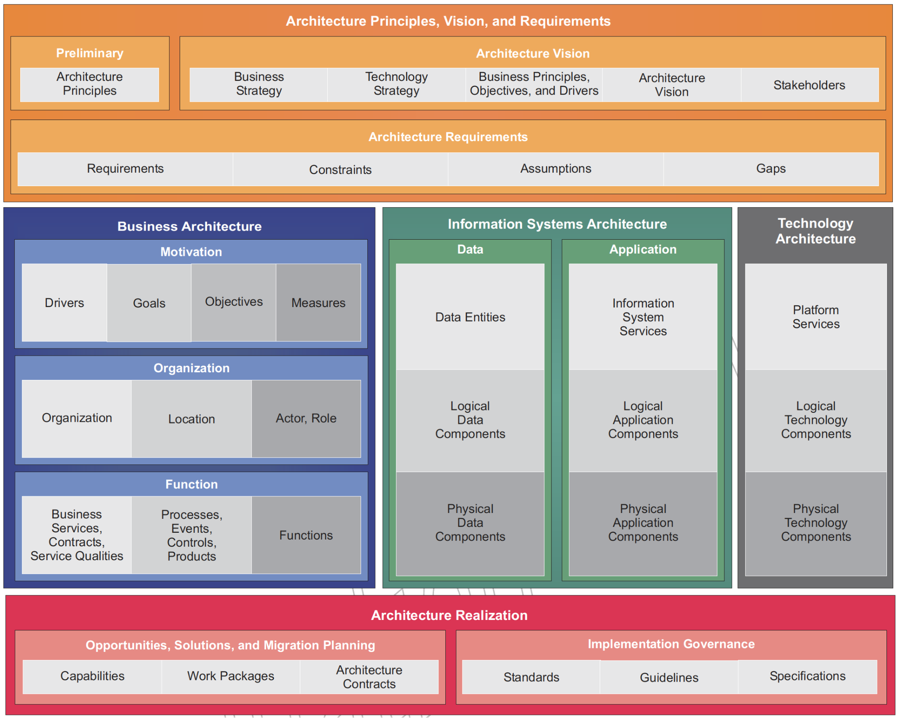
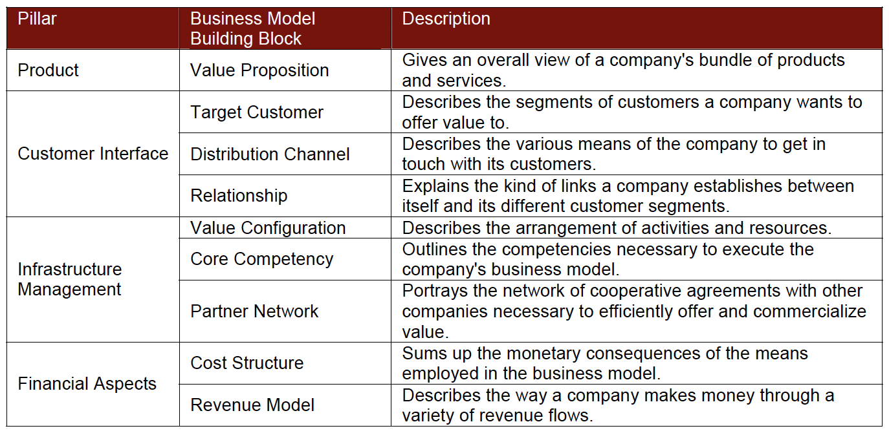
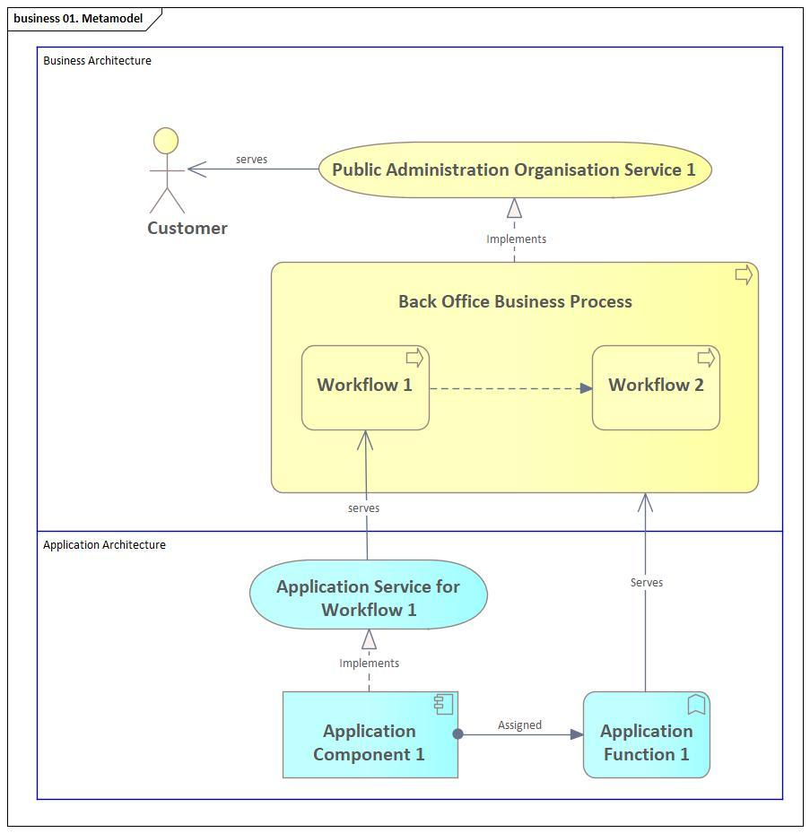

# 7. Annex 2 – Metamodel of Reference Architecture

## Methodology Baseline

To define the reference architecture of a public administration organisation (PAO) we adopted Open Group TOGAF framework:

<figure><figcaption>
Figure 26 - Architecture description components in TOGAF (Source: OGM)
</figcaption></figure>

Overall organisation architecture in TOGAF is defined by following layers

1. Business Architecture Layer,
2. Information Systems Architecture, including Data and Applications architectures and
3. Technology Architecture layer.

## Primary Viewpoints

The primary concern for the current document is to provide guidelines for structuring business and application target architecture during the planning of digital transformation.

To define business architecture, we are using the business model concept. In details business model is described in the \[1]. In \[3], the author provides the following short definition: “A business model is a conceptual tool containing a set of objects, concepts and their relationships with the objective to express the business logic of a specific firm. Therefore, we must consider which concepts and relationships allow a simplified description and representation of what value is provided to customers, how this is done and with which financial consequences”.

From an external perspective, a business model outlines how an organization conducts its operations. It encompasses the strategies and tactics employed by a company to achieve its goals \[1]. The following are main components of the business model:

<figure><figcaption>
Figure 27 - Business model components. 
</figcaption></figure>

Like that, business architecture will be described using a business model and then will be connected to the application architecture via required application services.&#x20;

Following is a metamodel, which we are using to define PAO reference architectures:

<figure><figcaption>
Figure 28 - Reference Architecture Metamodel
</figcaption></figure>

### Customer

A person or organization that is served by a public administration organisation.

### Service

A defined performance of a person or organization that meets a customer's needs.

### Business process

Ordered series of work processes that are carried out within one organization with the aim of providing a (combination of) service (s) to a citizen, company or organization.

### Workflow

An ordered series of process steps (business activities) carried out within one organizational unit within an organization with the aim of making a specific contribution (performance) to a service. (Can be a supporting process).

### Application function

Related functionality offered by an application component. An application function offers support to one or more business activities.

### Application component

The actual software that delivers the application functionality.

For modelling, ArchiMate 3.1 is used. For every class of customer, main services are defined with reference to a business process implementing the service. Business processes may give internal workflows, which are supported by application architecture services.
